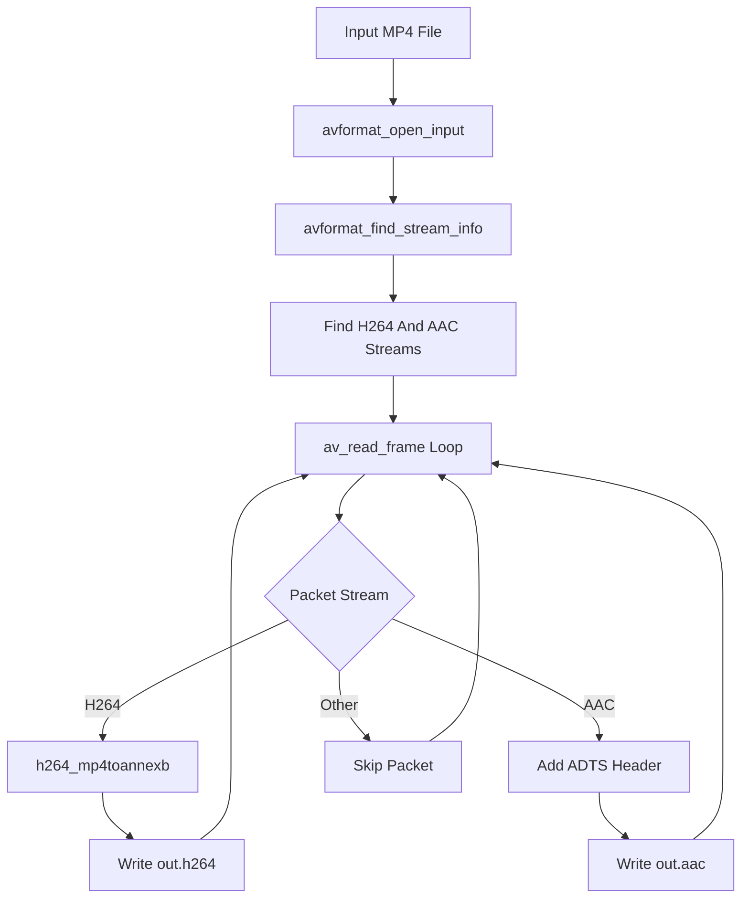

# AV-Demux-Extractor

AV-Demux-Extractor 是一个基于 C++17 和 FFmpeg API 实现的媒体文件解封装提取 Demo。项目用于学习如何从 MP4 等容器文件中读取压缩后的 `AVPacket`，并将其中的 H.264 视频和 AAC 音频提取为裸流文件。

本项目只做解封装和码流格式转换，不解码、不渲染、不编码。也就是说，程序不会把 H.264 解成 YUV，也不会把 AAC 解成 PCM，更不会重新编码输出新媒体文件。

## 项目功能

- 打开本地 MP4 文件。
- 查找第一路 H.264 视频流。
- 查找第一路 AAC 音频流。
- 使用 FFmpeg 解封装 API 循环读取 `AVPacket`。
- 将 MP4 中的 H.264 从 AVCC 格式转换为 Annex-B 裸流。
- 将 MP4 中的 AAC packet 补 ADTS 头后写为 `.aac` 文件。
- 输出 `out.h264` 和 `out.aac`，可使用 `ffplay` 验证。

## 技术栈

- C++17：用于资源管理、文件输出、异常处理和命令行程序组织。
- FFmpeg `libavformat`：负责打开输入文件、读取流信息和解封装 `AVPacket`。
- FFmpeg `libavcodec`：使用 bitstream filter 处理 H.264 码流格式。
- FFmpeg `libavutil`：基础错误信息和数据结构支持。
- CMake：负责项目构建配置。

## 核心技术实现

### 1. 解封装和解码的区别

解封装只负责从容器中取出压缩数据：

```text
MP4 container
  -> demux
  -> H.264 AVPacket / AAC AVPacket
```

解码则会把压缩数据变成原始帧：

```text
H.264 AVPacket -> decode -> YUV AVFrame
AAC AVPacket   -> decode -> PCM AVFrame
```

本项目只停留在 `AVPacket` 阶段，不进入 `AVFrame` 阶段。

### 2. 打开输入文件

程序启动后通过 `avformat_open_input` 打开输入文件，再通过 `avformat_find_stream_info` 读取容器和流信息。

随后遍历 `AVFormatContext::streams`：

- 找到 `AV_CODEC_ID_H264` 的视频流。
- 找到 `AV_CODEC_ID_AAC` 的音频流。

如果输入文件没有 H.264 或 AAC，程序会跳过对应输出；如果两者都没有，则直接退出。

### 3. H.264 提取

MP4 中的 H.264 通常是 AVCC 格式，NALU 前面是长度字段：

```text
NALU length + NALU data
```

而 `.h264` 裸流通常使用 Annex-B 格式：

```text
00 00 00 01 + NALU data
```

因此项目使用 FFmpeg 的 `h264_mp4toannexb` bitstream filter：

```text
MP4 H.264 packet
  -> h264_mp4toannexb
  -> Annex-B H.264 packet
  -> out.h264
```

这个过程只改写码流封装格式，不解码视频内容。

### 4. AAC 提取

MP4 中的 AAC packet 通常不带 ADTS 头，而独立 `.aac` 文件一般需要每一帧前面带 ADTS Header。

程序会从 AAC `extradata` 中读取：

- audio object type
- sample rate index
- channel config

然后为每个 AAC packet 生成 7 字节 ADTS Header，再写入输出文件：

```text
ADTS Header + AAC raw packet
```

### 5. AVPacket 数据流

项目核心循环是：

```text
av_read_frame
  -> 判断 stream_index
  -> H.264: bitstream filter 后写 out.h264
  -> AAC: 补 ADTS 后写 out.aac
  -> av_packet_unref
```

这里没有调用 `avcodec_send_packet`、`avcodec_receive_frame`、`avcodec_send_frame` 或 `avcodec_receive_packet`，因为这些属于解码或编码流程。

## 处理流程



## 环境依赖

当前项目主要在 Ubuntu/Linux 环境下开发和构建，依赖如下：

- CMake 3.10 或更高版本。
- 支持 C++17 的 C++ 编译器。
- FFmpeg 开发库：`libavformat`、`libavcodec`、`libavutil`。
- 可选验证工具：`ffplay`、`ffprobe`。

Ubuntu 下可以安装：

```bash
sudo apt update
sudo apt install -y build-essential cmake pkg-config \
    libavformat-dev libavcodec-dev libavutil-dev ffmpeg
```

## 构建方法

在项目目录下执行：

```bash
cmake -S . -B build
cmake --build build
```

也可以在仓库根目录执行：

```bash
cmake -S AV-Demos/AV-Demux-Extractor -B AV-Demos/AV-Demux-Extractor/build
cmake --build AV-Demos/AV-Demux-Extractor/build
```

构建成功后，会生成：

```text
build/av_demux_extractor
```

## 运行方法

```bash
./build/av_demux_extractor input.mp4 out.h264 out.aac
```

在仓库根目录下也可以执行：

```bash
./AV-Demos/AV-Demux-Extractor/build/av_demux_extractor input.mp4 out.h264 out.aac
```

验证输出：

```bash
ffplay out.h264
ffplay out.aac
```

也可以用 `ffprobe` 查看输入文件是否包含 H.264/AAC：

```bash
ffprobe input.mp4
```

## 项目结构

```text
AV-Demux-Extractor/
├── CMakeLists.txt              # CMake 构建配置
├── main.cpp                    # MP4 解封装和 H.264/AAC 裸流提取实现
├── README.md                   # 项目说明文档
└── build/                      # CMake 构建产物，不建议提交到 GitHub
```

## 当前限制

- 主要面向 MP4 中的 H.264 + AAC。
- 不支持 H.265/HEVC、MP3、Opus 等其他编码格式。
- 不解码、不渲染、不编码。
- 不重新封装输出 MP4、FLV 或 TS。
- AAC ADTS 头生成覆盖常见 AAC LC 场景，复杂 AAC 配置需要继续扩展。

## 后续可优化方向

- 支持 H.265，并使用 `hevc_mp4toannexb`。
- 支持只导出视频或只导出音频的命令行选项。
- 输出 packet 的 PTS、DTS、duration 和 keyframe 信息。
- 支持更多容器输入，例如 MKV、MOV、FLV。
- 将解封装逻辑封装成可复用模块，供播放器或转码器复用。

## 学习价值

- 理解容器格式和编码格式的区别。
- 理解 `AVPacket` 和 `AVFrame` 的区别。
- 理解为什么 MP4 H.264 需要转换成 Annex-B 才适合作为裸流播放。
- 理解为什么 MP4 AAC 导出为 `.aac` 时通常需要补 ADTS Header。
- 为后续学习解码、播放、转码和封装打基础。
