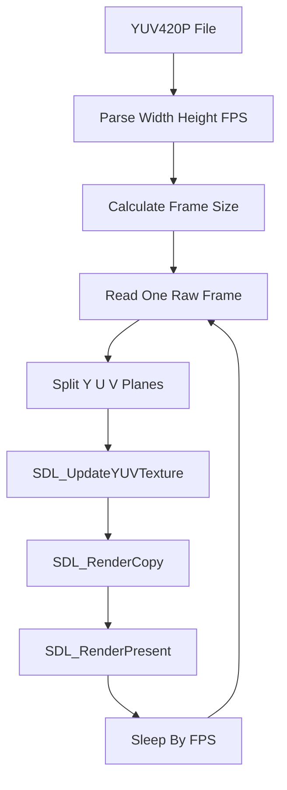

# AV-YUV420P-Player

AV-YUV420P-Player 是一个基于 C++17 和 SDL2 实现的极简 YUV420P 裸流播放器 Demo。项目主要用于学习原始视频帧的数据布局、YUV420P 平面格式、SDL2 YUV 纹理渲染以及最基础的视频帧刷新流程。

该项目不做封装解析和视频解码，只读取已经是 YUV420P 像素格式的裸数据文件。它适合放在完整播放器之前学习，用来理解“解码器输出的原始视频帧最终如何显示到窗口上”。

## 项目功能

- 支持读取本地 `.yuv` YUV420P 原始视频文件。
- 通过命令行指定视频宽度、高度和帧率。
- 按 YUV420P 一帧大小从文件中连续读取视频帧。
- 使用 SDL2 创建窗口、Renderer 和 `SDL_PIXELFORMAT_IYUV` 纹理。
- 通过 `SDL_UpdateYUVTexture` 将 Y、U、V 三个平面更新到 SDL2 纹理。
- 支持按 `Esc` 或关闭窗口退出。
- 当前构建配置面向 Ubuntu/Linux 环境，通过 `pkg-config` 自动查找 SDL2。

## 技术栈

- C++17：用于命令行解析、文件读取、缓冲区管理和基础流程控制。
- SDL2：负责窗口创建、事件处理、YUV 纹理更新和画面渲染。
- CMake：负责项目构建配置。
- GCC/G++：当前项目使用的 Ubuntu 20.04 C++ 编译环境。

## 核心技术实现

### 1. 命令行参数解析

程序启动时需要传入输入文件、宽度、高度和可选帧率：

```bash
./build/av_yuv420p_player input.yuv 640 360 25
```

裸 YUV 文件本身不包含宽、高、像素格式和帧率等元信息，所以播放器必须依赖用户传参。程序会检查宽高和帧率是否为正数，并要求宽度和高度为偶数，因为 YUV420P 的 U/V 平面宽高都是 Y 平面的一半。

### 2. YUV420P 帧大小计算

YUV420P 每一帧包含三个平面：

- Y 平面：`width * height`
- U 平面：`width / 2 * height / 2`
- V 平面：`width / 2 * height / 2`

因此一帧总大小为：

```text
width * height * 3 / 2
```

程序根据这个大小创建一块连续内存，每次从文件中读取一整帧。如果文件剩余数据不足一帧，就认为播放结束。

### 3. SDL2 初始化与窗口创建

程序使用 `SDL_Init` 初始化 SDL2 视频、事件和定时器模块，然后创建：

- `SDL_Window`：显示视频画面的窗口。
- `SDL_Renderer`：负责把纹理绘制到窗口。
- `SDL_Texture`：保存当前要显示的视频帧。

纹理格式使用 `SDL_PIXELFORMAT_IYUV`，它对应常见的 YUV420P/I420 平面布局。

### 4. YUV 平面拆分与纹理更新

从文件读出的一帧数据是连续排列的：

```text
YYYYYYYY...
UUUU...
VVVV...
```

程序通过偏移量切分出三个平面：

- `yPlane = frame.data()`
- `uPlane = yPlane + ySize`
- `vPlane = uPlane + uvSize`

随后调用 `SDL_UpdateYUVTexture` 分别传入 Y、U、V 平面的地址和 stride。这样不需要先把 YUV 转换成 RGB，SDL2 会在渲染链路中处理显示所需的格式转换。

### 5. 简单帧率控制

程序根据用户传入的 fps 计算每帧间隔：

```text
frameDuration = 1000 / fps 毫秒
```

每显示一帧后使用 `sleep_for` 等待下一帧。这个方式适合学习 Demo，但并不是精确的视频时钟方案。真实播放器通常会结合 PTS、音频时钟、系统时钟和渲染耗时进行同步。

## 播放流程



## 环境依赖

当前项目主要在 Ubuntu 20.04 环境下开发和构建，依赖如下：

- CMake 3.10 或更高版本。
- 支持 C++17 的 C++ 编译器。
- SDL2 开发库。
- `pkg-config`，用于让 CMake 找到 SDL2 的头文件和库文件路径。

如果系统还没有基础构建工具和 SDL2，可以先安装：

```bash
sudo apt update
sudo apt install -y build-essential cmake pkg-config libsdl2-dev
```

可以用下面命令确认 SDL2 是否能被 `pkg-config` 找到：

```bash
pkg-config --modversion sdl2
```

## 构建方法

在项目目录下执行：

```bash
cmake -S . -B build
cmake --build build
```

也可以在仓库根目录执行：

```bash
cmake -S AV-Demos/AV-YUV420P-Player -B AV-Demos/AV-YUV420P-Player/build
cmake --build AV-Demos/AV-YUV420P-Player/build
```

构建成功后，会在 `build` 目录下生成可执行文件：

```text
build/av_yuv420p_player
```

## 运行方法

运行时需要传入 YUV 文件路径、宽度、高度和可选帧率：

```bash
./build/av_yuv420p_player <input.yuv> <width> <height> [fps]
```

示例：

```bash
./build/av_yuv420p_player test_640x360.yuv 640 360 25
```

如果手上没有 YUV420P 测试文件，可以用 FFmpeg 从视频文件导出：

```bash
ffmpeg -i input.mp4 -pix_fmt yuv420p -s 640x360 test_640x360.yuv
```

也可以从仓库根目录运行：

```bash
./AV-Demos/AV-YUV420P-Player/build/av_yuv420p_player AV-Demos/AV-YUV420P-Player/build/test_640x360.yuv 640 360 25
```

## 项目结构

```text
AV-YUV420P-Player/
├── CMakeLists.txt              # CMake 构建配置
├── main.cpp                    # YUV420P 裸流读取和 SDL2 渲染实现
├── README.md                   # 项目说明文档
└── build/                      # CMake 构建产物，不建议提交到 GitHub
```

## 当前限制

- 只支持 YUV420P/I420 平面格式。
- 裸 YUV 文件不包含宽、高、帧率等元信息，所以必须手动传入。
- 没有封装解析和视频解码，不能直接播放 `.mp4`、`.flv`、`.mkv` 等媒体文件。
- 没有音频播放、音视频同步、暂停、seek 或循环播放。
- 当前使用简单 sleep 控制帧率，没有根据实际渲染耗时做精确时钟校准。

## 后续可优化方向

- 增加更多像素格式支持，例如 NV12、YUYV、RGB24。
- 增加暂停、继续、单帧步进和循环播放。
- 增加简单 UI 显示当前帧号、宽高和 fps。
- 支持从文件名中自动解析分辨率，例如 `test_640x360.yuv`。
- 对比 SDL2 YUV 纹理和 RGB 纹理的性能差异。
- 引入 FFmpeg 解码流程，逐步扩展成完整视频播放器。

## 学习价值

通过该项目可以学习到原始视频帧显示的最小链路：

- YUV420P 的平面布局和每帧大小计算。
- 裸视频文件为什么必须额外指定宽高和帧率。
- SDL2 如何创建窗口、Renderer 和 YUV Texture。
- 原始视频帧如何从文件读入内存并更新到纹理。
- 简单播放器如何通过帧间隔控制播放速度。

该项目适合作为 `AV-Easy-Player` 之前的前置 Demo，帮助先理解视频解码后最基础的画面显示过程。
