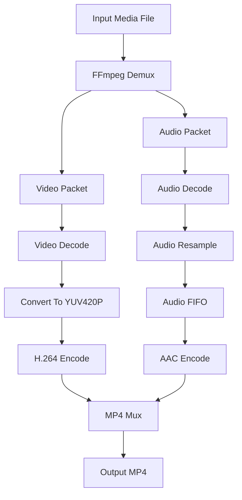

# AV-Transcoder

AV-Transcoder 是一个基于 C++17 和 FFmpeg API 实现的简易视频转码工具 Demo。项目主要用于学习媒体文件从输入到输出的完整转码流程，包括解封装、音视频解码、像素格式转换、音频重采样、重新编码和 MP4 封装。

该项目不是生产级转码器，而是一个尽量小、能跑通、便于阅读的学习项目。它会读取输入媒体文件，选择第一路视频流和第一路音频流，重新编码为 H.264 + AAC，并输出为 MP4 文件。

## 项目功能

- 支持打开常见本地媒体文件作为输入。
- 自动选择第一路视频流和第一路音频流。
- 使用 FFmpeg 解封装输入文件并读取 `AVPacket`。
- 使用 FFmpeg 解码音频帧和视频帧。
- 视频统一转换为 YUV420P，再编码为 H.264。
- 音频统一转换到 AAC 编码器支持的采样格式、采样率和声道布局。
- 使用 `AVAudioFifo` 缓存音频样本，按编码器需要的帧大小送入 AAC 编码器。
- 使用 MP4 封装器输出 H.264 + AAC 文件。
- 当前构建配置面向 Ubuntu/Linux 环境，通过 `pkg-config` 自动查找 FFmpeg 开发库。

## 技术栈

- C++17：用于封装转码流程、智能指针、错误处理和基础资源管理。
- FFmpeg 新版开发库：负责解封装、解码、编码、重采样、像素格式转换和封装输出。
- CMake：负责项目构建配置。
- GCC/G++：当前项目使用的 Ubuntu 20.04 C++ 编译环境。

## 核心技术实现

### 1. 输入文件解封装

程序启动后通过 `avformat_open_input` 打开输入媒体文件，再通过 `avformat_find_stream_info` 读取流信息。随后分别调用 `av_find_best_stream` 查找第一路视频流和第一路音频流。

如果输入文件只有视频或只有音频，程序也会尽量处理可用的媒体流。如果既没有音频也没有视频，则直接退出。

### 2. 解码器初始化

每一路输入流都会创建对应的 `AVCodecContext`：

- 视频解码器将压缩视频 packet 解码为原始视频帧。
- 音频解码器将压缩音频 packet 解码为原始 PCM 音频帧。

初始化流程主要包括：

- `avcodec_find_decoder`
- `avcodec_alloc_context3`
- `avcodec_parameters_to_context`
- `avcodec_open2`

### 3. 输出容器与编码器初始化

输出文件使用 `avformat_alloc_output_context2` 创建 MP4 输出上下文，然后通过 `avformat_new_stream` 创建输出视频流和音频流。

视频编码器：

- 优先查找 `libx264`。
- 如果没有 `libx264`，回退到 FFmpeg 内置 H.264 编码器。
- 输出像素格式统一为 `AV_PIX_FMT_YUV420P`。
- 默认码率为 2 Mbps。
- 默认 GOP 大小为 50。

音频编码器：

- 使用 AAC 编码器。
- 默认音频码率为 128 Kbps。
- 采样率优先沿用输入音频采样率，异常时使用 48000 Hz。
- 采样格式选择编码器支持的第一个格式。

### 4. 视频像素格式转换

输入视频解码后的像素格式不一定适合 H.264 编码器，例如可能是 YUV420P、NV12、YUVJ420P、RGB 等。

项目使用 `libswscale` 创建 `SwsContext`，将解码后的视频帧转换为 H.264 编码器需要的 YUV420P：

```text
decoded AVFrame
  -> sws_scale
  -> YUV420P AVFrame
  -> H.264 encoder
```

视频输出帧的 PTS 使用一个递增计数生成，适合学习最小链路。复杂输入中的可变帧率、B 帧和异常时间戳需要更完整的时间戳处理。

### 5. 音频重采样与 FIFO

输入音频解码后可能和 AAC 编码器要求不一致，例如采样格式、采样率或声道布局不同。

项目使用 `libswresample` 的 `SwrContext` 完成转换：

```text
decoded audio AVFrame
  -> swr_convert
  -> encoder-compatible audio samples
```

AAC 编码器通常需要固定数量的样本才能编码一帧，常见为 1024 个采样点。解码器输出的音频帧大小不一定刚好匹配，所以项目使用 `AVAudioFifo` 缓存转换后的样本，再按编码器 `frame_size` 取出并送入编码器。

### 6. 编码与写文件

项目使用 FFmpeg 新版 send/receive 编码接口：

- `avcodec_send_frame`：把原始音视频帧送入编码器。
- `avcodec_receive_packet`：从编码器取出压缩后的 packet。
- `av_packet_rescale_ts`：把编码器时间基转换为输出流时间基。
- `av_interleaved_write_frame`：将 packet 交错写入 MP4 文件。

转码结束后，程序会 flush 解码器、音频 FIFO 和编码器，最后调用 `av_write_trailer` 写入文件尾。

## 转码流程



## 环境依赖

当前项目主要在 Ubuntu 20.04 环境下开发和构建，依赖如下：

- CMake 3.10 或更高版本。
- 支持 C++17 的 C++ 编译器。
- FFmpeg 开发库。
- `pkg-config`，用于让 CMake 找到 FFmpeg 的头文件和库文件路径。

如果系统还没有基础构建工具，可以先安装：

```bash
sudo apt update
sudo apt install -y build-essential cmake pkg-config
```

如果 FFmpeg 是源码编译安装，需要确认 `pkg-config` 能找到 FFmpeg：

```bash
pkg-config --modversion libavformat libavcodec libavutil libswscale libswresample
```

如果上面的命令找不到 FFmpeg，可以临时设置：

```bash
export PKG_CONFIG_PATH=/usr/local/lib/pkgconfig:/usr/local/lib/x86_64-linux-gnu/pkgconfig:$PKG_CONFIG_PATH
```

如果你的 FFmpeg 安装到了其他 prefix，例如 `/opt/ffmpeg`，则把对应路径加入 `PKG_CONFIG_PATH`：

```bash
export PKG_CONFIG_PATH=/opt/ffmpeg/lib/pkgconfig:$PKG_CONFIG_PATH
```

项目的 `CMakeLists.txt` 会通过 `pkg-config` 查找以下库：

- `libavformat`
- `libavcodec`
- `libavutil`
- `libswscale`
- `libswresample`

## 构建方法

在项目目录下执行：

```bash
cmake -S . -B build
cmake --build build
```

也可以在仓库根目录执行：

```bash
cmake -S Demos/AV-Transcoder -B Demos/AV-Transcoder/build
cmake --build Demos/AV-Transcoder/build
```

构建成功后，会在 `build` 目录下生成可执行文件：

```text
build/av_transcoder
```

## 运行方法

运行时需要传入输入媒体文件和输出 MP4 文件路径：

```bash
./build/av_transcoder <input-media> <output.mp4>
```

示例：

```bash
./build/av_transcoder input.mkv output.mp4
```

如果使用仓库里的测试文件，可以在项目目录下执行：

```bash
./build/av_transcoder ../test-files/yanhua.mp4 output.mp4
```

可以用 `ffprobe` 检查输出文件：

```bash
ffprobe -hide_banner output.mp4
```

## 项目结构

```text
AV-Transcoder/
├── CMakeLists.txt              # CMake 构建配置
├── main.cpp                    # 转码器主体实现
├── README.md                   # 项目说明文档
└── build/                      # CMake 构建产物，不建议提交到 GitHub
```

## 当前限制

- 只处理第一路视频流和第一路音频流。
- 不处理字幕、章节、封面、旋转元数据和复杂 metadata。
- 视频码率、GOP、音频码率等参数写在代码中，没有命令行参数。
- 没有滤镜、裁剪、缩放参数、硬件加速或多线程任务管理。
- 时间戳处理以学习 Demo 为目标，不适合直接用于生产环境。
- 没有进度条、转码速度统计和中断恢复能力。

## 后续可优化方向

- 增加命令行参数，例如 `--video-bitrate`、`--audio-bitrate`、`--width`、`--height`。
- 支持只转封装 remux，不重新编码。
- 支持保留或复制 metadata。
- 增加字幕流处理。
- 增加转码进度显示和速度统计。
- 引入 `libavfilter` 支持缩放、裁剪、水印、旋转、音量调整等处理。
- 支持硬件编码，例如 VAAPI、NVENC、QSV。
- 拆分源码文件，将输入、解码、编码、封装和工具函数模块化。

## 学习价值

通过该项目可以学习到 FFmpeg 转码工具的基础架构：

- FFmpeg 如何打开输入文件并查找音视频流。
- 解码和编码的 send/receive API 如何配合使用。
- 视频为什么经常需要转换到 YUV420P。
- 音频为什么需要重采样和 FIFO。
- MP4 输出文件头、packet 写入和文件尾的基本顺序。
- 时间基和时间戳为什么是转码工具中的关键问题。

该项目适合作为从播放器 Demo 继续进入转码、录制、推流和视频处理工具的基础工程。
