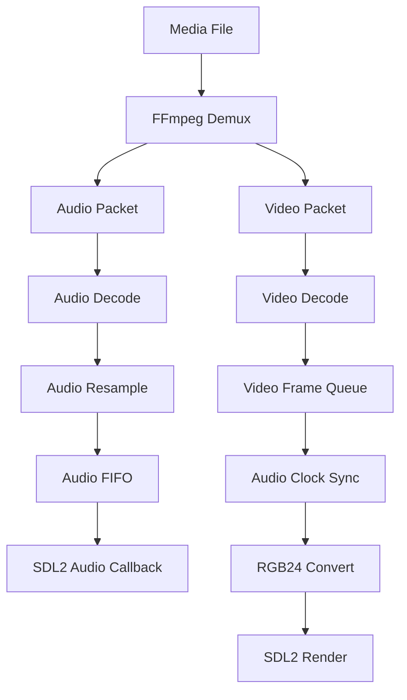

# EasyPlayer

EasyPlayer 是一个基于 C++、FFmpeg 和 SDL2 实现的简易音视频播放器 Demo。项目主要用于学习音视频播放器的基础流程，包括媒体文件解封装、音视频解码、音频播放、视频渲染、线程通信以及音视频同步等核心技术。

该项目不是完整的商业播放器，而是一个面向学习和实验的最小播放器实现，适合用于理解 FFmpeg 与 SDL2 在播放器开发中的协作方式。

## 项目功能

- 支持打开本地媒体文件进行播放。
- 使用 FFmpeg 读取媒体文件并解析音视频流。
- 使用 FFmpeg 解码音频帧和视频帧。
- 使用 SDL2 输出音频并创建窗口渲染视频画面。
- 以音频时钟为基准进行基础音视频同步。
- 使用线程安全队列缓存视频帧，避免解码和渲染流程互相阻塞。
- 当前构建配置面向 Ubuntu/Linux 环境，通过 `pkg-config` 自动查找 FFmpeg 和 SDL2。

## 技术栈

- C++11：用于实现播放器主体逻辑、线程、智能指针和同步机制。
- FFmpeg 新版开发库：负责媒体解封装、音视频解码、音频重采样和视频像素格式转换。
- SDL2：负责音频设备输出、窗口创建、事件循环和视频画面渲染。
- CMake：负责项目构建配置。
- GCC/G++：当前项目使用的 Ubuntu 20.04 C++ 编译环境。

## 核心技术实现

### 1. FFmpeg 解封装与流查找

程序启动后通过 `avformat_open_input` 打开用户传入的媒体文件，再通过 `avformat_find_stream_info` 读取媒体流信息。随后遍历 `AVFormatContext` 中的 stream，分别找到第一个视频流和第一个音频流。

如果文件中缺少音频流或视频流，程序会直接退出。

### 2. 音视频解码

项目分别为音频流和视频流创建 `AVCodecContext`：

- 视频解码器用于将压缩视频包解码为原始视频帧。
- 音频解码器用于将压缩音频包解码为原始音频帧。

解封装线程中不断调用 `av_read_frame` 读取 `AVPacket`，根据 packet 所属 stream 判断是音频还是视频，然后调用 FFmpeg 的 send/receive 解码接口完成解码。

### 3. 音频重采样与 SDL2 播放

音频部分使用 `SwrContext` 将输入音频格式转换为 SDL2 方便播放的格式：

- 输出采样格式：`AV_SAMPLE_FMT_S16`
- 输出声道数：2
- 输出采样率：优先使用原音频采样率，异常时回退到 48000

解码后的音频数据会经过 `swr_convert` 转换，然后写入 `AVAudioFifo`。SDL2 音频设备通过回调函数主动拉取音频数据进行播放。

这种方式可以让音频播放由 SDL2 音频设备驱动，而不是在主线程中手动阻塞播放音频。

### 4. 视频像素格式转换与渲染

视频解码得到的帧不一定适合直接显示，因此项目使用 `SwsContext` 将视频帧转换为 `RGB24` 格式。

转换后的图像数据通过 SDL2 更新到纹理中，再由 SDL2 Renderer 绘制到窗口：

- `SDL_UpdateTexture` 更新视频纹理。
- `SDL_RenderClear` 清空当前画面。
- `SDL_RenderCopy` 将纹理复制到渲染器。
- `SDL_RenderPresent` 显示最终画面。

SDL2 的事件循环运行在主线程中，这样可以保持窗口拖拽、缩放和关闭事件的响应。

### 5. 线程安全视频帧队列

项目实现了一个模板类 `FrameQueue<T>`，内部使用：

- `std::queue`
- `std::mutex`
- `std::condition_variable`

该队列用于在解码线程和主渲染线程之间传递视频帧。队列设置了最大长度，避免解码速度过快导致内存持续增长。

当程序退出时，队列可以通过 `setAbort` 唤醒等待中的线程，保证程序能够正常结束。

### 6. 音视频同步

项目以音频为同步基准。SDL2 音频回调每次被调用时，会根据已经送入 SDL2 的音频样本数推进音频时钟。

视频渲染时会比较当前视频帧时间戳和音频时钟：

- 如果视频帧比音频快太多，则短暂等待。
- 如果视频帧明显落后于音频，则丢弃该视频帧。
- 如果两者差距在阈值范围内，则正常渲染。

当前同步阈值由代码中的 `SYNC_THRESHOLD` 控制。

## 播放流程



## 环境依赖

当前项目主要在 Ubuntu 20.04 环境下开发和构建，依赖如下：

- CMake 3.10 或更高版本
- 支持 C++11 的 C++ 编译器
- FFmpeg 新版开发库（当前环境为 2026-04-04 编译的开发版）
- SDL2 开发库
- `pkg-config`，用于让 CMake 找到 FFmpeg 和 SDL2 的头文件、库文件路径

如果系统还没有基础构建工具和 SDL2，可以先安装：

```bash
sudo apt update
sudo apt install -y build-essential cmake pkg-config libsdl2-dev
```

如果 FFmpeg 是源码编译并安装到 `/usr/local`，通常还需要确认 `pkg-config` 能找到 FFmpeg 的 `.pc` 文件：

```bash
pkg-config --modversion libavformat libavcodec libavutil libswscale libswresample
```

如果上面的命令找不到 FFmpeg，可以临时设置：

```bash
export PKG_CONFIG_PATH=/usr/local/lib/pkgconfig:/usr/local/lib/x86_64-linux-gnu/pkgconfig:$PKG_CONFIG_PATH
```

如果你的 FFmpeg 安装到了其他 prefix，例如 `/opt/ffmpeg`，则把对应路径加入 `PKG_CONFIG_PATH`：

```bash
export PKG_CONFIG_PATH=/opt/ffmpeg/lib/pkgconfig:$PKG_CONFIG_PATH
```

项目的 `CMakeLists.txt` 会通过 `pkg-config` 查找以下库：

- `libavformat`
- `libavcodec`
- `libavutil`
- `libswscale`
- `libswresample`
- `sdl2`

## 构建方法

在项目目录下执行：

```bash
cmake -S . -B build
cmake --build build
```

构建成功后，会在 `build` 目录下生成可执行文件：

```text
build/av_player
```

如果 FFmpeg 安装在非系统默认路径，建议在同一个终端里先设置 `PKG_CONFIG_PATH`，再执行 CMake：

```bash
export PKG_CONFIG_PATH=/usr/local/lib/pkgconfig:/usr/local/lib/x86_64-linux-gnu/pkgconfig:$PKG_CONFIG_PATH
cmake -S . -B build
cmake --build build
```

## 运行方法

运行时需要传入一个本地媒体文件路径：

```bash
./build/av_player test.mp4
```

也可以传入绝对路径：

```bash
./build/av_player /home/yourname/Videos/test.mp4
```

程序运行后会创建 SDL2 窗口播放视频，并通过 SDL2 音频设备播放声音。关闭窗口即可退出程序。

## 项目结构

```text
EasyPlayer/
├── CMakeLists.txt              # CMake 构建配置
├── main.cpp                    # 播放器主体实现
├── README.md                   # 项目说明文档
├── .vscode/
│   └── c_cpp_properties.json   # Linux 下的 VS Code C/C++ IntelliSense 配置
└── build/                      # CMake 构建产物，不建议提交到 GitHub
```

## 当前限制

- 当前只实现基础播放流程，没有播放控制界面。
- 暂不支持暂停、继续、拖动进度条、倍速播放、音量控制等功能。
- 暂不支持字幕显示。
- 暂不支持播放列表。
- 当前要求输入文件同时包含音频流和视频流。
- 当前依赖 `pkg-config` 查找 FFmpeg；如果 FFmpeg 是源码安装，需要确保 `PKG_CONFIG_PATH` 配置正确。

## 后续可优化方向

- 增加更完善的错误日志，输出 FFmpeg/SDL2 初始化失败的具体原因。
- 增加暂停、继续、停止和进度跳转功能。
- 增加音量控制和静音功能。
- 支持无音频文件或无视频文件。
- 拆分源码文件，将解封装、解码、音频、视频、同步逻辑模块化。

## 学习价值

通过该项目可以学习到一个播放器的基础架构：

- FFmpeg 如何打开媒体文件并读取音视频流。
- FFmpeg 如何解码音频和视频。
- SDL2 如何播放音频和渲染视频。
- 解码线程和渲染线程如何通过队列通信。
- 音视频同步为什么通常需要一个主时钟。
- C++ 中如何使用 RAII、智能指针和线程同步机制管理音视频资源。

该项目为音视频开发入门示例，也可以作为继续扩展播放器功能的基础工程。
