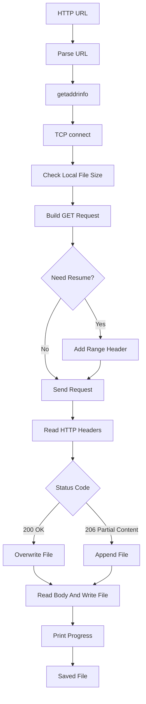

# HTTP-File-Downloader

HTTP-File-Downloader 是一个基于 C++17 和原生 POSIX Socket API 实现的简易 HTTP 文件下载器 Demo。项目主要用于学习 HTTP/1.1 请求响应、TCP 连接、URL 解析、响应头解析、文件写入、下载进度显示以及基于 `Range` 请求的断点续传。

该项目只支持明文 HTTP，不支持 HTTPS、代理、重定向和 chunked transfer。它不是通用下载器，而是面向学习的最小实现，适合用于理解后续 HLS、DASH、HTTP-FLV 等基于 HTTP 的流媒体协议。

## 项目功能

- 解析 `http://host[:port]/path` 格式 URL。
- 根据 URL 自动提取 host、端口和 path。
- 使用 `getaddrinfo` 做 DNS 解析。
- 使用 `socket` 和 `connect` 建立 TCP 连接。
- 发送 HTTP/1.1 `GET` 请求。
- 如果本地输出文件已存在，自动携带 `Range: bytes=<size>-` 尝试断点续传。
- 支持 `200 OK` 完整下载和 `206 Partial Content` 续传下载。
- 解析 HTTP 状态行和响应头。
- 根据 `Content-Length` 显示下载进度。
- 将响应体保存到本地文件。

## 技术栈

- C++17：用于字符串解析、文件读写、容器管理和基础流程组织。
- POSIX Socket API：负责 DNS 解析、TCP 连接和数据收发。
- HTTP/1.1：负责文件下载请求、响应头解析和断点续传。
- CMake：负责项目构建配置。
- GCC/G++：当前项目使用的 Ubuntu 20.04 C++ 编译环境。

## 核心技术实现

### 1. URL 解析

程序只支持明文 HTTP URL，例如：

```text
http://example.com/index.html
http://example.com:8080/files/video.mp4
```

解析后会得到：

- host：服务器域名或 IP。
- port：端口，默认是 `80`。
- path：HTTP 请求路径，默认是 `/`。

如果用户没有指定输出文件名，程序会从 URL path 的最后一段推导文件名。如果 path 为空，则使用 `download.bin`。

### 2. TCP 连接建立

下载器使用 `getaddrinfo` 解析 host 和 port，得到可能的 IPv4 或 IPv6 地址列表，然后依次尝试：

- `socket` 创建 TCP socket。
- `connect` 连接服务器。
- 成功后使用该连接发送 HTTP 请求。

当前实现使用阻塞 socket，逻辑更直观，适合先学习 HTTP 下载主流程。

### 3. HTTP GET 请求

普通下载时，请求大致如下：

```text
GET /path/file.mp4 HTTP/1.1
Host: example.com
User-Agent: av-study-http-downloader/1.0
Accept: */*
Connection: close
```

`Connection: close` 表示服务端响应完成后关闭 TCP 连接。这样 Demo 可以通过连接关闭来辅助判断响应体结束，避免先引入连接复用等更复杂的 HTTP 行为。

### 4. 断点续传

程序启动时会检查输出文件是否已经存在。如果本地文件大小大于 0，就认为可以尝试续传，并发送：

```text
Range: bytes=<local-size>-
```

服务端如果支持 Range，通常会返回：

```text
HTTP/1.1 206 Partial Content
```

这时程序以 append 模式打开本地文件，把后续响应体追加到已有内容后面。

如果服务端返回：

```text
HTTP/1.1 200 OK
```

说明服务端返回的是完整文件，程序会从头覆盖输出文件，避免把完整文件重复追加到已有文件后面。

### 5. 响应头解析

HTTP 响应由状态行、响应头和响应体组成：

```text
HTTP/1.1 200 OK
Content-Length: 12345
Content-Type: application/octet-stream

<body bytes>
```

程序会持续 `recv`，直到读到 `\r\n\r\n`，也就是响应头结束位置。头部之后已经读到的部分会作为响应体前缀写入文件。

当前 Demo 会解析：

- HTTP 状态码。
- `Content-Length`。
- `Transfer-Encoding`。

如果发现 `Transfer-Encoding: chunked`，程序会提示暂不支持并退出。

### 6. 下载进度显示

如果响应头里包含 `Content-Length`，程序可以计算总下载大小：

```text
total = resumeFrom + contentLength
```

每次从 socket 读取一段响应体并写入文件后，程序会刷新当前下载字节数和百分比。

如果没有 `Content-Length`，程序仍然可以下载，但只能显示已下载字节数，不能计算百分比。

## 下载流程



## 环境依赖

当前项目主要在 Ubuntu 20.04 环境下开发和构建，依赖如下：

- CMake 3.10 或更高版本。
- 支持 C++17 的 C++ 编译器。
- Linux/POSIX socket 环境。

如果系统还没有基础构建工具，可以先安装：

```bash
sudo apt update
sudo apt install -y build-essential cmake
```

项目不依赖 libcurl，也不依赖 OpenSSL，目的是直接学习 HTTP over TCP 的基础实现。

## 构建方法

在项目目录下执行：

```bash
cmake -S . -B build
cmake --build build
```

也可以在仓库根目录执行：

```bash
cmake -S Demos/HTTP-File-Downloader -B Demos/HTTP-File-Downloader/build
cmake --build Demos/HTTP-File-Downloader/build
```

构建成功后，会在 `build` 目录下生成可执行文件：

```text
build/http_file_downloader
```

## 运行方法

运行时传入 HTTP URL 和可选输出文件名：

```bash
./build/http_file_downloader <http-url> [output-file]
```

示例：

```bash
./build/http_file_downloader http://example.com/index.html index.html
```

如果不指定输出文件名，程序会从 URL path 中取最后一段作为文件名。

如果从仓库根目录运行，可以使用：

```bash
./Demos/HTTP-File-Downloader/build/http_file_downloader http://example.com/index.html index.html
```

## 断点续传测试方法

可以先开始下载一个较大的 HTTP 文件，中途按 `Ctrl+C` 终止程序。再次执行相同命令时，如果本地文件已经存在，程序会自动带上 `Range` 请求头尝试续传。

注意：断点续传是否成功取决于服务端是否支持 Range。如果服务端不支持，程序会收到 `200 OK`，并从头覆盖下载。

## 项目结构

```text
HTTP-File-Downloader/
├── CMakeLists.txt              # CMake 构建配置
├── main.cpp                    # HTTP 下载器主体实现
├── README.md                   # 项目说明文档
└── build/                      # CMake 构建产物，不建议提交到 GitHub
```

## 当前限制

- 只支持 `http://`，不支持 `https://`。
- 不处理 HTTP 301/302/307/308 重定向。
- 不支持 `Transfer-Encoding: chunked`。
- 断点续传依赖服务端支持 `Range` 请求。
- 没有下载速度统计、超时控制、限速和重试机制。
- 没有多线程分片下载。
- 没有校验文件完整性，例如 MD5、SHA256 或 ETag 校验。

## 后续可优化方向

- 支持 301/302 重定向，解析 `Location` 响应头。
- 支持 chunked transfer 解码。
- 增加 socket 读写超时。
- 增加下载速度、平均速度和预计剩余时间显示。
- 支持多线程分片下载。
- 支持 ETag、Last-Modified 和 If-Range，提高断点续传可靠性。
- 引入 TLS 支持 HTTPS，或对比使用 OpenSSL 和 libcurl 的实现复杂度。
- 基于 HTTP 下载器继续实现 HLS `.m3u8` 解析和分片下载。

## 学习价值

通过该项目可以学习到 HTTP 下载器的基础架构：

- URL 如何拆成 host、port 和 path。
- HTTP 请求报文和响应报文的基本结构。
- TCP socket 如何承载 HTTP 数据。
- `Content-Length` 如何用于计算下载进度。
- `Range` 请求如何实现断点续传。
- 为什么 chunked transfer、重定向和 HTTPS 会让下载器复杂很多。

该项目可以作为学习 HLS、DASH、HTTP-FLV 等基于 HTTP 的音视频传输协议之前的基础网络 Demo。
