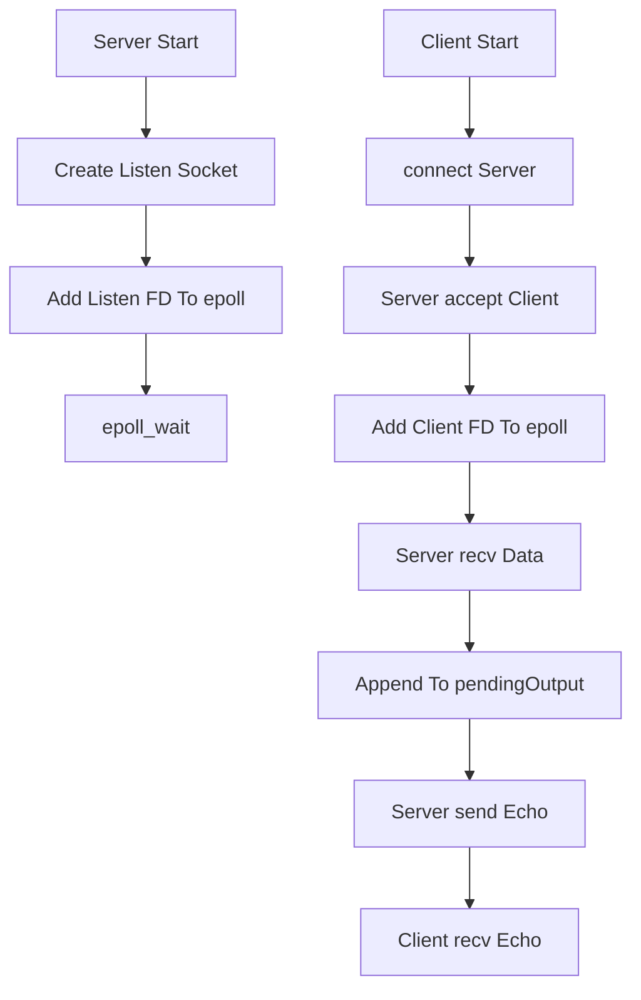

# AV-Net-TCP-Echo

AV-Net-TCP-Echo 是一个基于 C++17、POSIX Socket API 和 `epoll` 实现的 TCP Echo Demo。项目包含一个 TCP 服务端和一个 TCP 客户端，主要用于学习 Linux 网络编程中最基础的连接建立、数据收发、多客户端并发和 IO 多路复用流程。

该项目不是生产级网络框架，而是一个尽量小、能跑通、便于阅读和扩展的学习项目。它适合用于理解后续 HTTP 下载器、HTTP-FLV、RTMP、RTSP 等网络和流媒体协议的底层基础。

## 项目功能

- TCP 服务端绑定指定端口并监听客户端连接。
- TCP 客户端连接指定服务端地址和端口。
- 客户端从终端读取用户输入并发送给服务端。
- 服务端接收客户端数据后原封不动写回。
- 客户端接收服务端回显并打印。
- 服务端使用非阻塞 socket 和 `epoll` 支持多个客户端同时连接。
- 服务端为每个客户端维护待发送缓冲，处理非阻塞 `send` 可能只写出部分数据的问题。

## 技术栈

- C++17：用于字符串缓冲、容器管理、参数解析和基础流程组织。
- POSIX Socket API：负责 TCP socket 创建、绑定、监听、连接和数据收发。
- epoll：负责 Linux 下的 IO 多路复用和多客户端事件管理。
- CMake：负责项目构建配置。
- GCC/G++：当前项目使用的 Ubuntu 20.04 C++ 编译环境。

## 核心技术实现

### 1. 服务端监听 socket

服务端启动后会创建 TCP socket，并设置 `SO_REUSEADDR`：

- `socket` 创建 TCP 套接字。
- `setsockopt(SO_REUSEADDR)` 允许服务端重启后更快重新绑定端口。
- `bind` 将 socket 绑定到本机端口。
- `listen` 让 socket 进入监听状态。

监听 socket 会被设置为非阻塞模式，然后加入 epoll，等待新客户端连接事件。

### 2. 非阻塞 IO

服务端会把监听 fd 和客户端 fd 都设置为非阻塞。这样某个客户端暂时没有数据、发送缓冲区暂时不可写，或者连接建立瞬间没有更多连接可 accept 时，都不会阻塞整个服务端。

非阻塞 IO 中常见的返回情况：

- `EAGAIN` / `EWOULDBLOCK`：当前没有数据可读，或暂时不能继续写。
- `EINTR`：系统调用被信号中断，可以重试。
- `recv` 返回 0：对端关闭连接。

这些都不是简单地“成功/失败”二分，需要结合具体场景处理。

### 3. epoll 事件循环

服务端通过 `epoll_create1` 创建 epoll 实例，然后用 `epoll_ctl` 添加监听 fd 和客户端 fd。

主循环中调用 `epoll_wait` 等待事件：

- 如果事件来自监听 fd，说明有新连接到来，服务端循环 `accept` 直到没有更多连接。
- 如果事件来自客户端 fd，服务端根据事件类型处理读、写、异常或断开。
- `EPOLLIN` 表示可以读取客户端发来的数据。
- `EPOLLOUT` 表示 socket 发送缓冲区可写，可以继续发送待写数据。
- `EPOLLRDHUP`、`EPOLLHUP`、`EPOLLERR` 表示连接关闭或异常。

### 4. 客户端状态管理

服务端为每个客户端维护一个 `ClientState`：

```cpp
struct ClientState {
    std::string pendingOutput;
};
```

当服务端从客户端读到数据时，会把数据追加到 `pendingOutput`。当 fd 可写时，再尽量把 `pendingOutput` 中的数据发送出去。

这样做是因为 `send` 不保证一次写完所有数据，尤其在非阻塞 socket 下可能只写出一部分。待发送缓冲是事件驱动服务端中非常常见的设计。

### 5. TCP 客户端流程

客户端逻辑相对简单：

- 创建 TCP socket。
- 使用 `inet_pton` 解析 IPv4 地址。
- 通过 `connect` 连接服务端。
- 从终端读取一行文本。
- 调用 `send` 把文本发送给服务端。
- 根据发送字节数读取同样长度的回显数据。
- 打印服务端返回内容。

客户端使用阻塞 IO，目的是让学习重点集中在服务端的非阻塞 IO 和 epoll 事件处理上。

## 通信流程



## 环境依赖

当前项目主要在 Ubuntu 20.04 环境下开发和构建，依赖如下：

- CMake 3.10 或更高版本。
- 支持 C++17 的 C++ 编译器。
- Linux 系统，项目使用 `epoll`，不适用于 Windows 或 macOS 原生网络 API。

如果系统还没有基础构建工具，可以先安装：

```bash
sudo apt update
sudo apt install -y build-essential cmake
```

## 构建方法

在项目目录下执行：

```bash
cmake -S . -B build
cmake --build build
```

也可以在仓库根目录执行：

```bash
cmake -S Network-Demos/AV-Net-TCP-Echo -B Network-Demos/AV-Net-TCP-Echo/build
cmake --build Network-Demos/AV-Net-TCP-Echo/build
```

构建成功后，会在 `build` 目录下生成可执行文件：

```text
build/av_net_tcp_echo
```

## 运行方法

先启动服务端：

```bash
./build/av_net_tcp_echo server 9000
```

再打开另一个终端启动客户端：

```bash
./build/av_net_tcp_echo client 127.0.0.1 9000
```

如果从仓库根目录运行，可以使用：

```bash
./Network-Demos/AV-Net-TCP-Echo/build/av_net_tcp_echo server 9000
./Network-Demos/AV-Net-TCP-Echo/build/av_net_tcp_echo client 127.0.0.1 9000
```

客户端启动后输入任意文本并回车：

```text
> hello tcp
[echo] hello tcp
```

可以同时打开多个客户端终端连接同一个服务端端口，用来观察服务端如何处理多个连接。

## 项目结构

```text
AV-Net-TCP-Echo/
├── CMakeLists.txt              # CMake 构建配置
├── main.cpp                    # TCP Echo 服务端和客户端实现
├── README.md                   # 项目说明文档
└── build/                      # CMake 构建产物，不建议提交到 GitHub
```

## 当前限制

- 客户端只支持 IPv4 地址，例如 `127.0.0.1`。
- 客户端使用阻塞 IO，便于先理解基础收发流程。
- 协议没有消息头，客户端通过“发送多少字节就接收多少字节”的方式确认一次回显。
- 服务端只实现最小 Echo 行为，没有超时管理、限流、认证、日志系统或优雅退出。
- 当前只支持 Linux `epoll`，没有封装跨平台 IO 多路复用层。

## 后续可优化方向

- 支持命令行参数解析，例如 `--host`、`--port`、`--mode`。
- 增加优雅退出信号处理，例如收到 `SIGINT` 后关闭所有客户端 fd。
- 增加简单应用层协议，例如 `length + body`。
- 将服务端和客户端拆成不同源码文件。
- 将 epoll 封装成更清晰的事件循环类。
- 增加连接超时、空闲连接清理和最大连接数限制。
- 对比 `select`、`poll` 和 `epoll` 的差异。

## 学习价值

通过该项目可以学习到 Linux 网络编程的基础链路：

- TCP 服务端如何创建、绑定、监听和接受连接。
- TCP 客户端如何连接服务端并进行数据收发。
- 非阻塞 IO 和阻塞 IO 的行为差异。
- `epoll` 如何管理多个 fd 的读写事件。
- 为什么网络程序需要维护读写缓冲。
- TCP 是字节流协议，应用层需要自己定义消息边界。

相关 TCP、epoll 和 HTTP 下载知识点整理在 `Notes/streaming-protocols-and-networking.md`。

