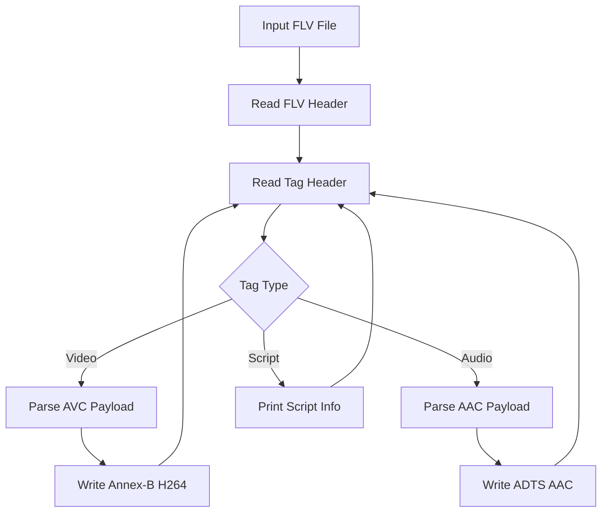

# FLV-Parser

FLV-Parser 是一个基于 C++17 和文件 IO 实现的手写 FLV 文件解析 Demo。项目用于学习 FLV 容器结构、FLV Header、FLV Tag、H.264 AVC sequence header、AAC sequence header，以及如何从 FLV 中导出 H.264 Annex-B 裸流和带 ADTS 头的 AAC 裸流。

该项目不依赖 FFmpeg 或其他多媒体库，解析逻辑尽量直接对应 FLV 文件格式。它适合配合 `RTMP-FLV-Recorder`、`HTTP-FLV-Player` 学习直播流中 FLV Tag 的组织方式。

## 项目功能

- 读取本地 `.flv` 文件。
- 解析 FLV Header 和每个 Tag 的类型、时间戳、数据大小。
- 解析 AVC sequence header，提取 SPS/PPS 并写入 Annex-B H.264。
- 解析 AAC sequence header，给 AAC raw frame 添加 ADTS 头。
- 输出 `out.h264` 和 `out.aac`，可用 `ffplay` 验证。

## 技术栈

- C++17：用于文件 IO、二进制缓冲区和基础解析流程。
- FLV 官方格式：Header、PreviousTagSize、Audio/Video/Script Tag。
- H.264 AVC 格式：SPS/PPS、NALU、AVCC 长度前缀。
- AAC 格式：AudioSpecificConfig、Raw AAC、ADTS Header。

## 核心技术实现

### 1. FLV Header 解析

FLV 文件开头是固定 Header：

```text
Signature: 3 bytes, 固定为 FLV
Version:   1 byte
Flags:     1 byte, 标记是否包含音频/视频
DataOffset:4 bytes
```

Header 后面紧跟 `PreviousTagSize0`，通常是 0。之后就是连续的 FLV Tag。

### 2. FLV Tag 解析

每个 FLV Tag 都有 11 字节 Tag Header：

```text
TagType       1 byte
DataSize      3 bytes
Timestamp     3 bytes
TimestampExt  1 byte
StreamID      3 bytes
```

常见 Tag 类型：

- `8`：Audio Tag。
- `9`：Video Tag。
- `18`：Script Data Tag。

程序会打印每个 Tag 的类型、时间戳和数据大小，便于观察直播流或文件流的帧顺序。

### 3. H.264 裸流导出

FLV 中的 H.264 通常不是 Annex-B 格式，而是 AVCC 格式：

```text
NALU length + NALU data
```

而 `.h264` 裸流常用 Annex-B 格式：

```text
00 00 00 01 + NALU data
```

所以导出时需要把 NALU 长度前缀改写为 start code。遇到 AVC sequence header 时，程序会提取 SPS/PPS，并先写入输出 H.264 文件。

### 4. AAC 裸流导出

FLV 中 AAC raw frame 默认没有 ADTS 头。很多播放器或分析工具播放 `.aac` 文件时需要 ADTS，所以程序会根据 AAC sequence header 中的信息生成 ADTS Header：

- profile
- sample rate index
- channel config
- frame length

然后将 ADTS Header 和 AAC raw frame 一起写入 `.aac` 文件。

## 解析流程



## 环境依赖

- CMake 3.10 或更高版本。
- 支持 C++17 的 C++ 编译器。
- 可选验证工具：`ffplay`。

## 构建方法

```bash
cmake -S . -B build
cmake --build build
```

也可以在仓库根目录执行：

```bash
cmake -S Network-Demos/FLV-Parser -B Network-Demos/FLV-Parser/build
cmake --build Network-Demos/FLV-Parser/build
```

## 运行方法

```bash
./build/flv_parser input.flv out.h264 out.aac
ffplay out.h264
ffplay out.aac
```

## 项目结构

```text
FLV-Parser/
├── CMakeLists.txt              # CMake 构建配置
├── main.cpp                    # FLV 解析和裸流导出实现
├── README.md                   # 项目说明文档
└── build/                      # CMake 构建产物，不建议提交到 GitHub
```

## 当前限制

- 主要覆盖 H.264 + AAC 的常见直播 FLV。
- AMF 脚本 Tag 只打印基础信息，没有完整解析 metadata。
- 没有处理所有音频编码和视频编码类型。
- 没有校验输出裸流的时间戳连续性。
- 对异常或损坏 FLV 文件只做基础保护。

## 后续可优化方向

- 完整解析 Script Data Tag 中的 AMF metadata。
- 支持更多音视频编码格式。
- 增加 FLV dump 工具，输出每个 Tag 的详细字段。
- 增加按时间戳切片导出能力。
- 和 `HTTP-FLV-Player` 复用一套流式 FLV Tag 解析器。

## 学习价值

- FLV Tag 类型：8 音频，9 视频，18 脚本数据。
- H.264 在 FLV 中通常以 AVCC 长度前缀存放，裸流常用 Annex-B start code。
- AAC 在 FLV 中不带 ADTS 头，导出裸 AAC 文件时需要补 ADTS。
