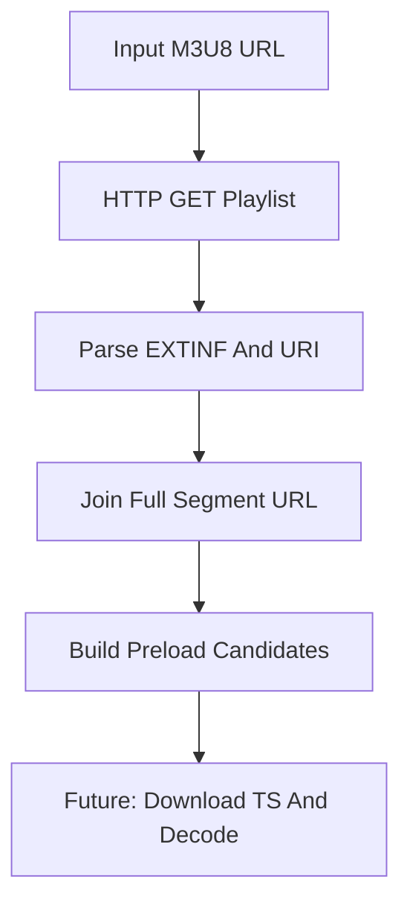

# HLS-Player

HLS-Player 是一个基于 C++17 的 HLS 播放器学习版骨架。当前实现重点放在 M3U8 下载、媒体切片 URL 提取和预加载调度思路，用于理解 HLS 播放器在真正解码播放之前需要完成的 playlist 解析和切片调度工作。

该项目当前不会下载和解码 TS 切片，而是展示 HLS 播放器最前面的调度层。后续可以继续接入 TS 下载队列、FFmpeg 解封装/解码和 SDL2 播放。

## 项目功能

- 输入 `http://` M3U8 地址。
- 下载 playlist 并解析 `EXTINF` 和切片 URI。
- 拼接完整 TS 切片 URL。
- 打印前几个预加载候选切片。

## 技术栈

- C++17：用于 URL 解析、HTTP 文本读取和切片列表管理。
- POSIX Socket：通过 HTTP GET 获取 M3U8 文本。
- HLS：媒体 playlist、`EXTINF`、TS/fMP4 切片 URI。
- CMake：负责项目构建配置。

## 核心技术实现

### 1. 下载 M3U8

程序输入一个明文 HTTP M3U8 地址：

```text
http://host/live/index.m3u8
```

内部通过 TCP Socket 发送 HTTP GET 请求，读取响应体作为 playlist 文本。

### 2. 解析媒体切片

媒体 playlist 中常见内容：

```text
#EXTM3U
#EXT-X-TARGETDURATION:4
#EXTINF:4.000,
segment0.ts
#EXTINF:4.000,
segment1.ts
```

程序会解析 `EXTINF` 表示的切片时长，并读取下一行 URI 作为切片路径。

### 3. 相对 URL 拼接

HLS playlist 中的切片路径经常是相对地址，例如：

```text
segment0.ts
```

播放器需要基于当前 M3U8 URL 拼接成完整地址：

```text
http://host/live/segment0.ts
```

这是后续切片下载队列的基础。

### 4. 预加载调度思路

真实 HLS 播放器不会只下载当前切片，而是会维护一个预加载窗口。当前 Demo 通过打印前几个切片，展示后续可以按如下策略扩展：

- 下载当前播放点附近的若干切片。
- 失败时重试或切换码率。
- 直播场景定时刷新 playlist。
- 点播场景按顺序下载直到 `EXT-X-ENDLIST`。

## 播放准备流程



## 环境依赖

- CMake 3.10 或更高版本。
- 支持 C++17 的 C++ 编译器。
- Linux/POSIX Socket 环境。

## 构建方法

```bash
cmake -S . -B build
cmake --build build
```

也可以在仓库根目录执行：

```bash
cmake -S Network-Demos/HLS-Player -B Network-Demos/HLS-Player/build
cmake --build Network-Demos/HLS-Player/build
```

## 运行方法

```bash
./build/hls_player http://example.com/live/index.m3u8
```

建议先用稳定的本地 HTTP 服务或本地 HLS 测试流验证，公共 HLS 地址可能会失效、需要 HTTPS 或带鉴权参数。

## 项目结构

```text
HLS-Player/
├── CMakeLists.txt              # CMake 构建配置
├── main.cpp                    # M3U8 下载、切片解析和预加载展示
├── README.md                   # 项目说明文档
└── build/                      # CMake 构建产物，不建议提交到 GitHub
```

## 当前限制

- 只支持明文 HTTP。
- 当前不下载 TS 内容，只解析和展示调度结果。
- 没有实现真正的解码播放。
- 没有处理主 playlist、多码率切换或加密切片。
- 没有直播 playlist 刷新逻辑。

## 后续完善方向

- 复用 `M3U8-Parser` 支持主 playlist 和直播动态刷新。
- 增加 TS 切片下载队列和重试。
- 使用 FFmpeg 解封装 TS，解码 H.264/AAC。
- 使用 SDL2 播放音频和渲染视频。
- 实现切片间连续播放和音视频同步。
- 支持 `EXT-X-KEY` 加密切片。
- 支持自适应码率 ABR 策略。

## 学习价值

- 理解 HLS 播放器为什么以 M3U8 为入口。
- 理解 playlist 解析、切片下载和解码播放之间的关系。
- 理解 HLS 相比 RTMP/HTTP-FLV 的高延迟来源。
- 为后续实现完整 HLS 播放器拆出清晰阶段。
