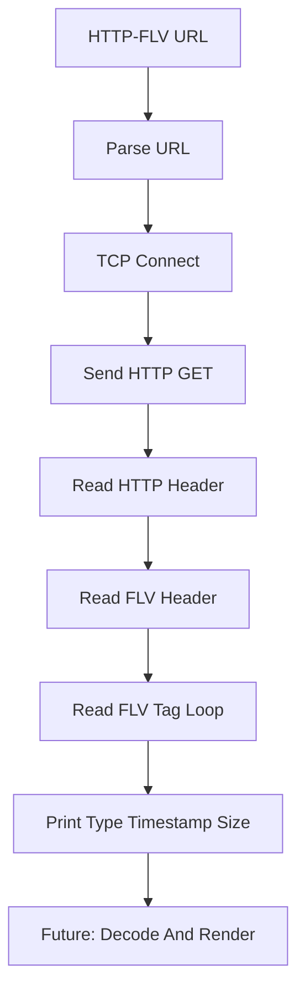

# HTTP-FLV-Player

HTTP-FLV-Player 是一个基于 C++17 和原生 TCP Socket 实现的 HTTP-FLV 播放器学习版骨架。当前实现重点放在手写 HTTP 请求、HTTP 响应头解析、FLV Header 读取和实时 FLV Tag 解析，用来理解 HTTP-FLV 直播流在进入解码器之前的网络和容器层处理。

该项目当前不会真正解码播放音视频，而是把 HTTP-FLV 拉流和 FLV Tag 解析链路拆开展示。后续可以继续接入 FFmpeg 解码和 SDL2 播放。

## 项目功能

- 输入 `http://` FLV 直播流 URL。
- 使用原生 TCP Socket 发送 HTTP/1.1 GET 请求。
- 解析 HTTP 响应头。
- 实时读取 FLV Header 和前若干个 FLV Tag。
- 打印 Tag 类型、时间戳和数据大小。

## 技术栈

- C++17：用于 URL 解析、字节缓冲和流式读取。
- POSIX Socket：`connect`、`send`、`recv`。
- HTTP/1.1：GET 请求、响应状态行和 Header。
- FLV：Header、Tag Header、Audio/Video/Script Tag。

## 核心技术实现

### 1. HTTP-FLV URL

HTTP-FLV 直播地址通常类似：

```text
http://host:port/live/stream.flv
```

程序会解析出：

- host
- port，默认 `80`
- path

然后使用 TCP 连接服务器。

### 2. HTTP GET 请求

客户端发送普通 HTTP/1.1 GET 请求：

```text
GET /live/stream.flv HTTP/1.1
Host: example.com
Connection: close
```

HTTP-FLV 的特点是响应体不是一次性文件，而是一段持续输出的 FLV 字节流。直播场景下连接可能长期保持打开。

### 3. 响应头解析

程序先读取 HTTP Header，检查状态码和响应头结束位置：

```text
\r\n\r\n
```

头部之后的字节就是 FLV 数据。解析网络流时要注意，Header 和 Body 可能在同一次 `recv` 中同时到达，所以程序需要保留 Header 之后已经读到的 body 数据。

### 4. FLV Tag 解析

HTTP-FLV 响应体从 FLV Header 开始，之后是连续的 FLV Tag。当前实现读取并打印：

- Tag 类型。
- 时间戳。
- Tag 数据大小。

真正播放器需要继续把 Video Tag 中的 H.264 和 Audio Tag 中的 AAC 解析出来并送入解码器。

## 播放链路



## 环境依赖

- CMake 3.10 或更高版本。
- 支持 C++17 的 C++ 编译器。
- Linux/POSIX Socket 环境。
- 可选：本地 SRS HTTP-FLV 服务或其他直播服务器。

## 构建方法

```bash
cmake -S . -B build
cmake --build build
```

也可以在仓库根目录执行：

```bash
cmake -S Network-Demos/HTTP-FLV-Player -B Network-Demos/HTTP-FLV-Player/build
cmake --build Network-Demos/HTTP-FLV-Player/build
```

## 运行方法

```bash
./build/http_flv_player http://example.com/live.flv
```

建议优先使用本地直播服务测试。公共 HTTP-FLV 地址经常失效，且部分地址可能需要 HTTPS、鉴权或防盗链。

## 项目结构

```text
HTTP-FLV-Player/
├── CMakeLists.txt              # CMake 构建配置
├── main.cpp                    # HTTP-FLV 拉流和 FLV Tag 解析
├── README.md                   # 项目说明文档
└── build/                      # CMake 构建产物，不建议提交到 GitHub
```

## 当前限制

- 只支持明文 HTTP，不支持 HTTPS。
- 当前只解析 FLV Tag，不做实际解码播放。
- 不支持 chunked transfer、重连和网络抖动缓冲。
- 没有解析 H.264 SPS/PPS 和 AAC sequence header。
- 没有音视频同步、缓存队列和渲染线程。

## 后续完善方向

- 复用 `Network-Demos/FLV-Parser` 的 tag 解析逻辑。
- 将 H.264/AAC payload 送入 FFmpeg 解码器。
- 使用 SDL2 渲染视频、播放音频。
- 以音频时钟为主实现基础音视频同步。
- 支持断线重连和直播缓冲队列。
- 支持 HTTPS 和 HTTP chunked transfer。

## 学习价值

- 理解 HTTP-FLV 和普通 HTTP 文件下载的区别。
- 理解 HTTP Header 与 FLV Body 的边界处理。
- 理解直播场景下流式解析而不是一次性读取文件。
- 为后续实现真正的 HTTP-FLV 播放器提供网络层骨架。
