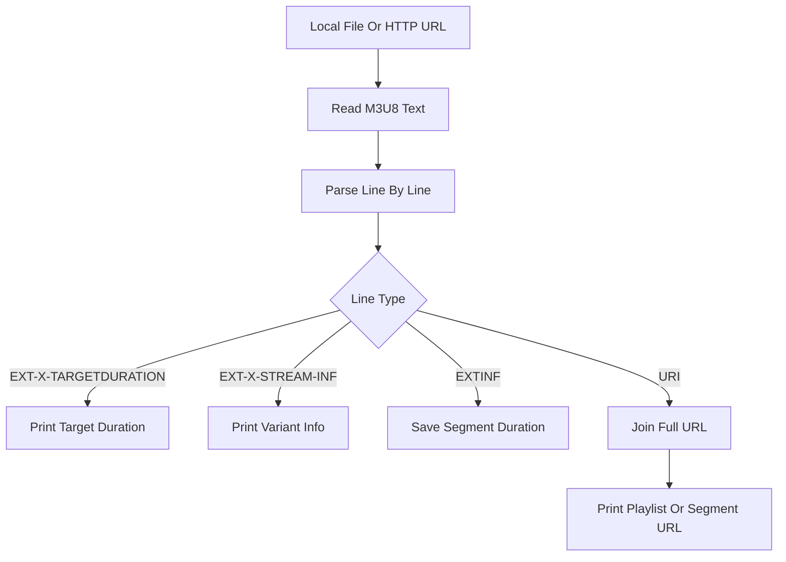

# M3U8-Parser

M3U8-Parser 是一个基于 C++17 和字符串解析实现的 HLS playlist 解析 Demo。项目用于学习 RFC8216 中 M3U8 文件结构、主 playlist、媒体 playlist、`EXT-X-*` 标签、TS 切片地址提取和相对 URL 拼接。

该项目不依赖 HLS 第三方库，网络输入也只用简单 HTTP Socket 请求，目的是帮助理解 HLS 播放器在真正下载 TS 切片之前做了哪些 playlist 解析工作。

## 项目功能

- 读取本地 M3U8 文件或 `http://` M3U8 URL。
- 解析 `EXT-X-TARGETDURATION`。
- 解析 `EXT-X-STREAM-INF` 主 playlist 条目。
- 解析 `EXTINF` 和 TS/fMP4 切片 URI。
- 将相对 URI 拼成完整 HTTP URL。

## 技术栈

- C++17：用于文件读取、HTTP 文本读取和字符串解析。
- HLS / M3U8：解析主 playlist、媒体 playlist 和常见标签。
- POSIX Socket：读取 `http://` M3U8 URL。
- CMake：负责项目构建配置。

## 核心技术实现

### 1. 输入来源

程序支持两种输入：

- 本地文件路径，例如 `input.m3u8`。
- 明文 HTTP URL，例如 `http://example.com/live/index.m3u8`。

如果输入以 `http://` 开头，程序会使用 TCP Socket 发送 HTTP GET 请求并读取响应体；否则按本地文件读取。

### 2. 主 playlist 和媒体 playlist

HLS 常见两层结构：

```text
master.m3u8
  -> 720p/index.m3u8
  -> 1080p/index.m3u8
```

媒体 playlist 则直接包含切片：

```text
#EXTINF:4.000,
segment0.ts
#EXTINF:4.000,
segment1.ts
```

当前 Demo 会根据 `EXT-X-STREAM-INF` 判断是否出现子 playlist，并打印子 playlist URL 或媒体切片 URL。

### 3. 常见标签解析

当前重点解析：

- `EXT-X-TARGETDURATION`：切片最大时长。
- `EXT-X-STREAM-INF`：主 playlist 中的码率、分辨率等信息。
- `EXTINF`：单个媒体切片的时长。
- URI 行：子 playlist 或媒体切片地址。

对于相对路径，程序会基于当前 M3U8 URL 拼接完整地址。

### 4. 直播动态更新

直播 HLS 的媒体 playlist 通常没有 `EXT-X-ENDLIST`，服务端会不断追加新切片，并移除较旧切片。

当前 Demo 只做单次解析。完整播放器需要定时重新下载 playlist，比较新旧切片列表，只下载新增切片。

## 解析流程



## 环境依赖

- CMake 3.10 或更高版本。
- 支持 C++17 的 C++ 编译器。
- Linux/POSIX Socket 环境。

## 构建方法

```bash
cmake -S . -B build
cmake --build build
```

也可以在仓库根目录执行：

```bash
cmake -S Network-Demos/M3U8-Parser -B Network-Demos/M3U8-Parser/build
cmake --build Network-Demos/M3U8-Parser/build
```

## 运行方法

```bash
./build/m3u8_parser input.m3u8
./build/m3u8_parser http://example.com/live/index.m3u8
```

## 项目结构

```text
M3U8-Parser/
├── CMakeLists.txt              # CMake 构建配置
├── main.cpp                    # M3U8 文本读取和解析实现
├── README.md                   # 项目说明文档
└── build/                      # CMake 构建产物，不建议提交到 GitHub
```

## 当前限制

- 当前只支持明文 HTTP，不支持 HTTPS。
- 主要解析学习场景中最常见标签，没有实现完整 RFC8216。
- 直播动态更新需要外层循环定时重新请求，本 Demo 只做单次解析。
- 没有下载 TS 切片。
- 没有处理加密标签，例如 `EXT-X-KEY`。

## 后续可优化方向

- 支持 HTTPS。
- 支持主 playlist 自动选择某一路子 playlist。
- 支持直播场景定时刷新。
- 支持 `EXT-X-MEDIA-SEQUENCE`、`EXT-X-ENDLIST`、`EXT-X-KEY`。
- 输出 JSON 格式，方便被 HLS 播放器模块复用。

## 学习价值

- 理解 HLS 播放前为什么要先解析 M3U8。
- 区分主 playlist 和媒体 playlist。
- 理解 `EXTINF`、`EXT-X-TARGETDURATION` 和切片 URI 的关系。
- 为后续 HLS 播放器中的切片下载和预加载做准备。
