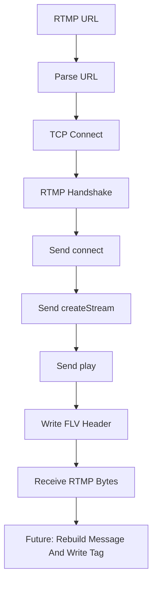

# RTMP-FLV-Recorder

RTMP-FLV-Recorder 是一个基于 `RTMP-Handshake` 扩展的学习版 RTMP 拉流录制骨架。项目用于学习 RTMP 拉流命令链路、`connect` / `createStream` / `play` 交互、FLV 文件头写入，以及从 RTMP 字节流走向标准 FLV 文件所需要的关键步骤。

当前版本重点展示 RTMP 播放链路的整体骨架，而不是完整生产级录制器。它适合作为理解 RTMP-FLV 直播录制流程的中间项目。

## 项目功能

- 解析 RTMP URL。
- 完成 TCP 连接和 RTMP simple handshake。
- 发送 `connect`、`createStream`、`play` AMF0 命令。
- 创建 FLV 文件头并持续接收服务器数据。

## 技术栈

- C++17：用于 URL 解析、二进制缓冲区、文件写入和超时控制。
- TCP Socket：连接 RTMP 服务器并持续读取数据。
- RTMP：握手、AMF0 命令、Chunk 传输。
- FLV：文件头、Tag 输出格式。

## 重要说明

当前版本是协议学习骨架：它已经展示 RTMP 拉流命令链路，但还没有完整实现 RTMP Chunk 分片重组和 message 到 FLV Tag 的转换。因此输出文件用于观察学习，不保证可被 VLC 直接播放。

完整版需要继续实现：

- chunk stream 按 CSID 保存历史 header。
- 按 message length 拼接完整 RTMP message。
- 将 audio/video/script message 写成标准 FLV Tag。
- 处理 `Set Chunk Size`、ack、window acknowledgement。

## 核心技术实现

### 1. RTMP 拉流 URL

RTMP 拉流 URL 通常类似：

```text
rtmp://host:1935/live/stream
```

程序会解析：

- host 和 port：用于建立 TCP 连接。
- app：用于 `connect` 命令。
- stream：用于 `play` 命令。

### 2. 命令链路

RTMP 拉流通常需要：

```text
connect -> createStream -> play
```

其中：

- `connect`：连接到某个 RTMP application。
- `createStream`：申请一个 stream id。
- `play`：请求播放指定流名。

当前实现为了突出主流程，采用学习版命令发送方式，尚未完整等待和解析每个命令响应。

### 3. FLV 文件头写入

标准 FLV 文件开头包含：

```text
FLV Signature + Version + Flags + HeaderSize + PreviousTagSize0
```

录制器创建输出文件后会先写入基础 FLV Header，后续完整实现需要将 RTMP audio/video/script message 转为 FLV Tag 后追加写入。

### 4. 为什么不能直接写 RTMP 原始字节

RTMP 传输层使用 Chunk 机制，一个完整音视频 message 可能被拆成多个 chunk。Chunk Header 还会复用历史字段，因此直接把 TCP 收到的字节写进 `.flv` 文件通常不是合法 FLV。

完整录制器必须先做：

```text
RTMP chunk -> RTMP message -> FLV tag
```

## 录制流程



## 环境依赖

- CMake 3.10 或更高版本。
- 支持 C++17 的 C++ 编译器。
- Linux/POSIX Socket 环境。
- 建议搭配 SRS 或 Nginx RTMP 本地服务测试。

## 构建方法

```bash
cmake -S . -B build
cmake --build build
```

也可以在仓库根目录执行：

```bash
cmake -S Network-Demos/RTMP-FLV-Recorder -B Network-Demos/RTMP-FLV-Recorder/build
cmake --build Network-Demos/RTMP-FLV-Recorder/build
```

## 运行方法

```bash
./build/rtmp_flv_recorder rtmp://example.com/live/stream output.flv 10
```

建议搭配本地 SRS 或 Nginx RTMP 服务测试，公共 RTMP 服务经常不可用。

参数含义：

- 第一个参数：RTMP 拉流地址。
- 第二个参数：输出 FLV 文件路径。
- 第三个参数：录制秒数。

## 项目结构

```text
RTMP-FLV-Recorder/
├── CMakeLists.txt              # CMake 构建配置
├── main.cpp                    # RTMP 拉流命令和文件写入骨架
├── README.md                   # 项目说明文档
└── build/                      # CMake 构建产物，不建议提交到 GitHub
```

## 当前限制

- 当前输出文件不保证是可播放 FLV。
- 没有完整 RTMP Chunk 分片重组。
- 没有把 audio/video/script message 转为标准 FLV Tag。
- 没有处理复杂网络异常、断线重连和超时恢复。
- 没有实现认证、加密 RTMPS 或推流功能。

## 后续可优化方向

- 实现 RTMP Chunk Stream 状态管理。
- 按 message length 重组完整 RTMP message。
- 将 message type id 为 audio/video/script 的消息写成 FLV Tag。
- 处理 `Set Chunk Size`、ack、window acknowledgement。
- 增加录制时长、文件大小、码率等统计信息。
- 输出文件后用 `ffprobe` 或 VLC 验证。

## 学习价值

- 理解 RTMP 拉流和 HTTP-FLV 拉流的差异。
- 理解为什么 RTMP 录制不能直接保存 TCP 原始字节。
- 理解 FLV Header、FLV Tag 和 RTMP message 的关系。
- 为后续实现完整 RTMP-FLV 录制器打基础。
