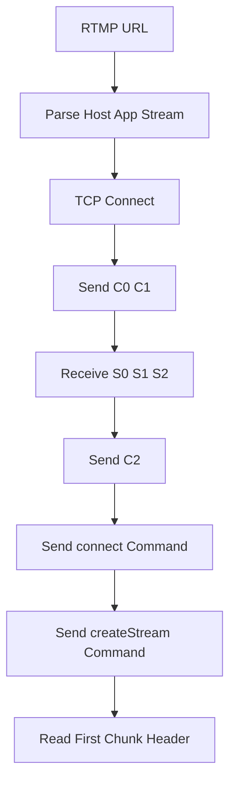

# RTMP-Handshake

RTMP-Handshake 是一个基于 C++17 和 TCP Socket 实现的纯手写 RTMP 连接学习 Demo。项目用于学习 RTMP URL 解析、TCP 连接、RTMP C0/C1/S0/S1/S2/C2 握手、AMF0 命令编码和 RTMP Chunk Header 基础解析。

该项目不依赖 `librtmp`、FFmpeg 或其他 RTMP 协议库，目的是直接理解 RTMP 协议连接建立阶段的字节级交互。

## 项目功能

- 解析 `rtmp://host[:port]/app[/stream]` URL。
- 使用 TCP Socket 连接 RTMP 服务器。
- 完成 C0/C1/S0/S1/S2/C2 简单握手。
- 发送 AMF0 `connect` 和 `createStream` 命令。
- 读取并打印首个 RTMP Chunk Header 的基础字段。

## 技术栈

- C++17：用于 URL 解析、字节缓冲区、AMF0 编码和流程控制。
- TCP Socket：`connect`、`send`、`recv`。
- RTMP 1.0：simple handshake、chunk basic header、command message。
- AMF0：编码 `connect`、`createStream` 命令参数。

## 核心技术实现

### 1. RTMP URL 解析

RTMP URL 常见格式：

```text
rtmp://host:1935/app/stream
```

程序会拆出：

- host：服务器地址。
- port：端口，默认 `1935`。
- app：应用名，例如 `live`。
- stream：流名。
- tcUrl：`rtmp://host/app`，用于 `connect` 命令。

### 2. RTMP 握手

当前实现 simple handshake：

```text
Client -> C0 + C1
Server -> S0 + S1 + S2
Client -> C2
```

其中：

- C0/S0：RTMP 版本，通常为 `3`。
- C1/S1：1536 字节，包含时间戳、版本和随机数据。
- C2/S2：用于回应对方的握手数据。

### 3. AMF0 命令编码

RTMP 命令消息通常使用 AMF0 编码。当前实现了学习所需的最小编码：

- String
- Number
- Boolean
- Null
- Object
- Object end

`connect` 命令会携带 `app`、`tcUrl`、`audioCodecs`、`videoCodecs` 等字段。

### 4. RTMP Chunk Header 观察

RTMP message 会被拆成 chunk 传输。程序读取服务器响应后，打印第一个 chunk 的基础字段：

- fmt：chunk header 类型。
- csid：chunk stream id。
- type id：message type id。
- message length：message 长度。

这一步主要用于理解 RTMP 后续为什么需要按 chunk stream 重组 message。

## 交互流程



## 环境依赖

- CMake 3.10 或更高版本。
- 支持 C++17 的 C++ 编译器。
- Linux/POSIX Socket 环境。
- 可选：SRS 或 Nginx RTMP 本地测试服务器。
- 可选：Wireshark 抓包观察 RTMP 交互。

## 构建方法

```bash
cmake -S . -B build
cmake --build build
```

也可以在仓库根目录执行：

```bash
cmake -S Network-Demos/RTMP-Handshake -B Network-Demos/RTMP-Handshake/build
cmake --build Network-Demos/RTMP-Handshake/build
```

## 运行方法

```bash
./build/rtmp_handshake rtmp://example.com/live/stream
```

建议优先使用本地 SRS 或 Nginx RTMP 服务测试，因为公共 RTMP 测试服务经常不可用。

## 项目结构

```text
RTMP-Handshake/
├── CMakeLists.txt              # CMake 构建配置
├── main.cpp                    # RTMP 握手和基础命令实现
├── README.md                   # 项目说明文档
└── build/                      # CMake 构建产物，不建议提交到 GitHub
```

## 当前限制

- 只实现学习版 simple handshake。
- AMF0 和 RTMP Chunk 解析只覆盖核心字段。
- 没有完整事务管理、ack/window、set chunk size、错误恢复。
- 公共 RTMP 测试服务经常不可用，建议搭配本地 Nginx RTMP 或 SRS 测试。

## 后续可优化方向

- 完整解析 RTMP message。
- 维护 transaction id 和命令响应。
- 处理 `Set Chunk Size`、ack、window acknowledgement。
- 支持 `play`、`publish` 和 metadata。
- 增加 RTMP Chunk 分片重组器。

## 学习价值

- 理解 RTMP 为什么先握手再发命令。
- 理解 C0/C1/S0/S1/S2/C2 的顺序。
- 理解 AMF0 在 RTMP 命令中的作用。
- 理解 RTMP Chunk Header 是后续拉流/推流解析的基础。
