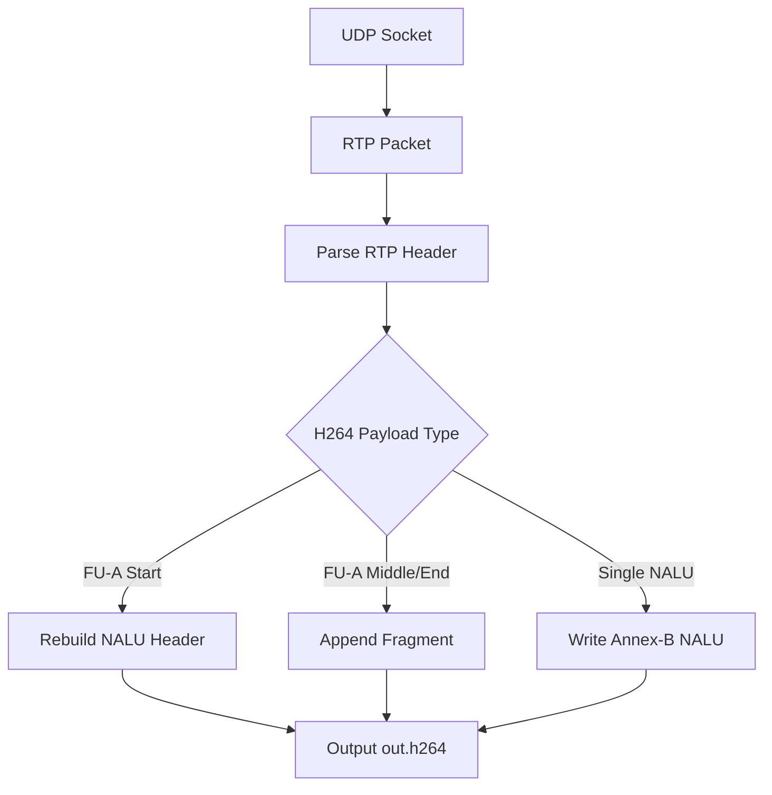

# RTP-Packet-Parser

RTP-Packet-Parser 是一个基于 C++17 和 UDP Socket 实现的 RTP/H.264 包解析学习 Demo。项目用于学习 RTP 包头结构、序列号、时间戳、payload type、marker bit，以及 H.264 在 RTP 中的 Single NALU 和 FU-A 分片重组方式。

该项目当前从 UDP 端口接收 RTP 包，把 H.264 payload 重组成 Annex-B `.h264` 裸流文件，便于使用 `ffplay` 验证。它适合配合 `RTSP-Client` 后续扩展成完整 RTSP/RTP 拉流解析链路。

## 项目功能

- 绑定 UDP 端口接收 RTP 包。
- 解析 RTP 版本、序列号、时间戳、负载类型和 marker。
- 支持 H.264 Single NALU 包。
- 支持 H.264 FU-A 分片重组。
- 输出 Annex-B H.264 裸流文件。

## 技术栈

- C++17：用于二进制缓冲区、文件输出和基础状态管理。
- UDP Socket：绑定端口并接收 RTP 数据报。
- RTP：解析标准 12 字节基础头。
- H.264 RTP Payload：Single NALU、FU-A。
- Annex-B：输出带 start code 的 H.264 裸流。

## 核心技术实现

### 1. RTP Header 解析

RTP 基础头通常为 12 字节：

```text
V/P/X/CC | M/PT | Sequence Number | Timestamp | SSRC
```

程序会解析：

- version：RTP 版本，通常为 2。
- marker：一帧结束标记，具体含义和编码格式有关。
- payload type：负载类型，例如 H.264 常见动态类型 96。
- sequence number：包序号，用于发现丢包和乱序。
- timestamp：采样时间戳，用于播放同步。
- ssrc：同步源标识。

### 2. Single NALU

如果 H.264 RTP payload 的 NALU 类型在 `1..23`，表示一个 RTP 包中包含一个完整 NALU。程序会直接写入：

```text
00 00 00 01 + NALU
```

### 3. FU-A 分片重组

当一个 H.264 NALU 太大无法放进一个 RTP 包时，会使用 FU-A 分片：

```text
FU indicator + FU header + fragment payload
```

FU header 中包含：

- Start bit：分片开始。
- End bit：分片结束。
- NALU type：原始 NALU 类型。

程序在 Start 分片时重建原始 NALU Header，并写入 Annex-B start code；中间分片和结束分片继续追加 payload。

### 4. 丢包检测

RTP 序列号递增。程序会保存上一个 sequence number，如果发现当前序列号不是预期值，会打印提示。这可以帮助理解实时传输中丢包、乱序和抖动缓冲的重要性。

## 数据流程



## 环境依赖

- CMake 3.10 或更高版本。
- 支持 C++17 的 C++ 编译器。
- Linux/POSIX Socket 环境。
- 可选验证工具：`ffplay`。

## 构建方法

```bash
cmake -S . -B build
cmake --build build
```

也可以在仓库根目录执行：

```bash
cmake -S Network-Demos/RTP-Packet-Parser -B Network-Demos/RTP-Packet-Parser/build
cmake --build Network-Demos/RTP-Packet-Parser/build
```

## 运行方法

```bash
./build/rtp_packet_parser 5004 out.h264
ffplay out.h264
```

需要有 RTP/H.264 数据发送到本机 `5004` UDP 端口。后续可以结合 RTSP 服务或 FFmpeg 推送 RTP 流测试。

## 项目结构

```text
RTP-Packet-Parser/
├── CMakeLists.txt              # CMake 构建配置
├── main.cpp                    # RTP 包头解析和 H.264 payload 重组
├── README.md                   # 项目说明文档
└── build/                      # CMake 构建产物，不建议提交到 GitHub
```

## 当前限制

- 当前只处理 H.264 RTP payload。
- 只做基础序列号缺口提示，没有乱序缓存和重传。
- 没有解析 RTCP。
- 没有支持 STAP-A、FU-B 等更多 H.264 RTP 打包模式。
- 没有根据时间戳做播放节奏控制。

## 后续可优化方向

- 增加乱序缓存和按 sequence number 排序。
- 支持 STAP-A 聚合包。
- 解析 RTCP Sender Report / Receiver Report。
- 和 `RTSP-Client` 联动，接收真正 RTSP 会话中的 RTP 数据。
- 将输出裸流改为送入 FFmpeg 解码器。
- 增加统计信息，例如丢包率、抖动、码率。

## 学习价值

- 理解 RTP Header 每个字段的作用。
- 理解 H.264 大帧为什么需要 FU-A 分片。
- 理解 Annex-B 裸流和 RTP payload 之间的转换关系。
- 为实时音视频传输、RTSP 播放器和 WebRTC RTP 学习打基础。
