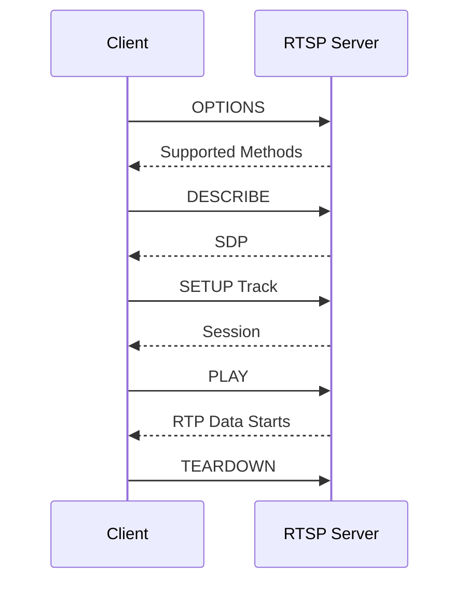

# RTSP-Client

RTSP-Client 是一个基于 C++17 和 TCP Socket 实现的纯手写 RTSP 交互学习 Demo。项目用于学习 RTSP URL 解析、RTSP 请求/响应格式、`OPTIONS` / `DESCRIBE` / `SETUP` / `PLAY` / `TEARDOWN` 基础流程、SDP 解析和 RTP over TCP interleaved 的基本概念。

该项目当前只完成 RTSP 控制链路，不真正接收和解码 RTP 音视频数据。它适合作为进入 RTP、RTCP、RTSP 摄像头拉流之前的协议入门项目。

## 项目功能

- 解析 `rtsp://host[:port]/path` URL。
- 使用 TCP Socket 发送 RTSP 请求。
- 实现 `OPTIONS`、`DESCRIBE`、`SETUP`、`PLAY`、`TEARDOWN` 基础流程。
- 打印 SDP 和服务器响应。
- 从 SDP 中提取第一个 media track 的 `a=control`。

## 技术栈

- C++17：用于 URL 解析、请求组装、响应解析和 SDP 文本处理。
- POSIX Socket：通过 TCP 连接 RTSP 服务端。
- RTSP：控制协议，请求/响应模型，CSeq，Session。
- SDP：描述媒体 track、编码格式和 control 地址。
- RTP over TCP：使用 interleaved 通道承载 RTP/RTCP。

## 核心技术实现

### 1. RTSP URL 解析

RTSP 地址常见格式：

```text
rtsp://host:554/live.sdp
```

程序会解析：

- host
- port，默认 `554`
- path
- base URL

这些字段用于后续拼接 RTSP 请求行和 track control URL。

### 2. RTSP 请求格式

RTSP 请求和 HTTP 类似，也是文本协议：

```text
OPTIONS rtsp://example.com/live.sdp RTSP/1.0
CSeq: 1
```

每个请求都需要递增 `CSeq`。`SETUP` 成功后，服务器通常会返回 `Session`，后续 `PLAY`、`TEARDOWN` 需要带上这个 Session。

### 3. 基础交互流程

当前实现的主流程：

```text
OPTIONS -> DESCRIBE -> SETUP -> PLAY -> TEARDOWN
```

各步骤含义：

- `OPTIONS`：查询服务器支持的方法。
- `DESCRIBE`：请求 SDP。
- `SETUP`：建立媒体传输通道。
- `PLAY`：开始播放。
- `TEARDOWN`：关闭会话。

### 4. SDP 解析

`DESCRIBE` 响应体通常是 SDP，例如：

```text
m=video 0 RTP/AVP 96
a=rtpmap:96 H264/90000
a=control:trackID=0
```

程序会提取第一个 `a=control`，用于拼接 `SETUP` 请求地址。

### 5. RTP over TCP interleaved

当前 Demo 使用 RTP over TCP interleaved 请求：

```text
Transport: RTP/AVP/TCP;unicast;interleaved=0-1
```

这表示 RTP/RTCP 会复用 RTSP TCP 连接，通过 `$` 开头的 interleaved frame 传输。当前项目只完成 SETUP，不继续解析这些 RTP 数据。

## 交互流程



## 环境依赖

- CMake 3.10 或更高版本。
- 支持 C++17 的 C++ 编译器。
- Linux/POSIX Socket 环境。
- 可选：VLC、Live555、摄像头或本地 RTSP 服务。

## 构建方法

```bash
cmake -S . -B build
cmake --build build
```

也可以在仓库根目录执行：

```bash
cmake -S Network-Demos/RTSP-Client -B Network-Demos/RTSP-Client/build
cmake --build Network-Demos/RTSP-Client/build
```

## 运行方法

```bash
./build/rtsp_client rtsp://example.com/live.sdp
```

公共 RTSP 地址可能经常失效。实际测试时可以使用本地 RTSP 服务、局域网摄像头，或使用 VLC/FFmpeg 搭建测试流。

## 项目结构

```text
RTSP-Client/
├── CMakeLists.txt              # CMake 构建配置
├── main.cpp                    # RTSP 请求、响应和 SDP 解析实现
├── README.md                   # 项目说明文档
└── build/                      # CMake 构建产物，不建议提交到 GitHub
```

## 当前限制

- 当前使用 RTP over TCP interleaved 的 SETUP 请求。
- 只提取第一个 track，没有真正接收和解析 RTP 数据。
- 不支持认证、重定向、UDP RTP 端口协商和保活。
- 没有处理多 track 音视频同步。
- 没有解析 RTCP。

## 后续可优化方向

- 支持 Basic/Digest 认证。
- 支持 UDP RTP 端口协商。
- 解析 RTP over TCP interleaved frame。
- 将 H.264 RTP payload 交给 `RTP-Packet-Parser` 逻辑重组。
- 增加 keepalive，例如周期发送 `GET_PARAMETER` 或 `OPTIONS`。
- 支持多个 track，例如 video + audio。

## 学习价值

- 理解 RTSP 是控制协议，不是媒体封装格式。
- 理解 SDP 在 RTSP 拉流中的作用。
- 理解 RTSP 和 RTP 的分工。
- 为后续实现摄像头拉流、RTP 解析和实时播放打基础。
