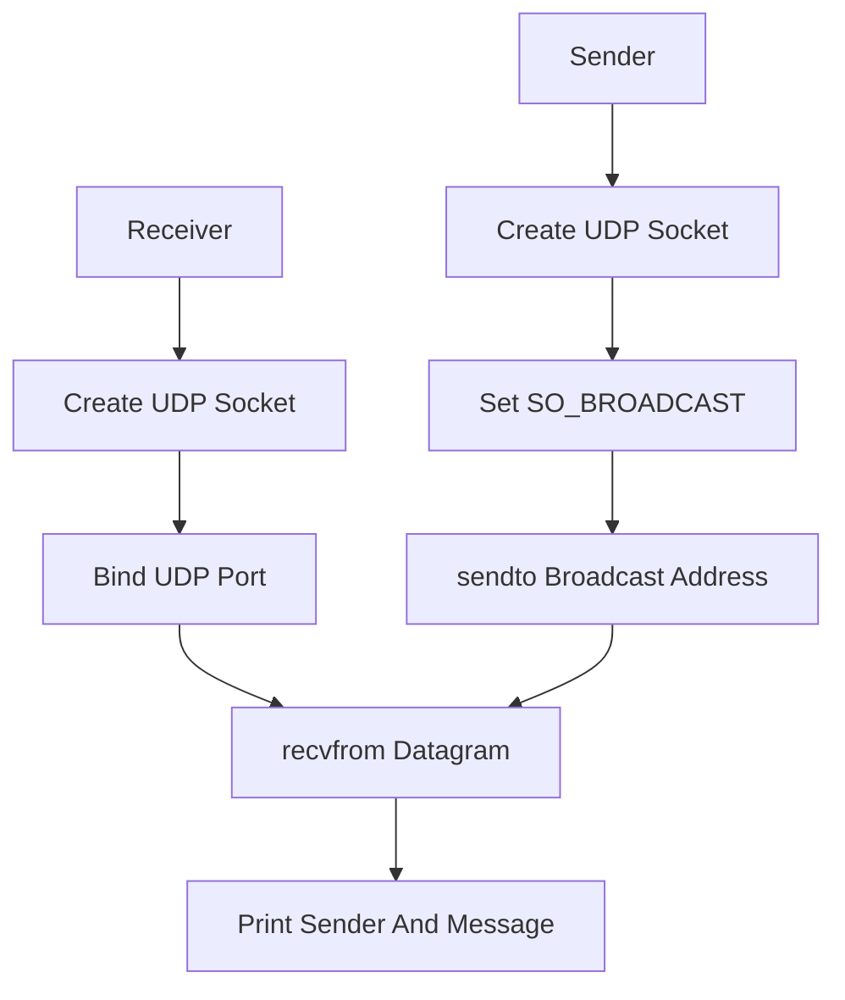

# UDP-Broadcast

UDP-Broadcast 是一个基于 C++17 和 Linux 原生 Socket API 实现的 UDP 广播学习 Demo。项目用于理解 UDP 无连接通信、局域网广播、`sendto` / `recvfrom` 数据收发、端口绑定和 Wireshark 抓包验证等基础网络编程知识。

该项目不依赖任何第三方网络库，发送端和接收端都直接使用 POSIX Socket。它适合作为学习 UDP、RTP、局域网设备发现、广播/组播之前的入门示例。

## 项目功能

- `send` 模式向指定广播地址和端口周期发送文本。
- `recv` 模式绑定 UDP 端口，接收同网段或可达广播报文。
- 支持设置广播地址、端口、发送间隔和消息内容。
- 可用 Wireshark 过滤 `udp.port == <port>` 验证广播报文。

## 技术栈

- C++17：用于命令行解析、字符串处理和发送间隔控制。
- POSIX Socket API：`socket`、`setsockopt`、`bind`、`sendto`、`recvfrom`、`close`。
- UDP 协议：无连接数据报通信。
- IP 广播：全局广播地址或网段定向广播地址。
- Wireshark：用于抓包观察 UDP 广播报文。

## 核心技术实现

### 1. UDP Socket 创建

发送端和接收端都使用：

```text
socket(AF_INET, SOCK_DGRAM, 0)
```

`SOCK_DGRAM` 表示数据报 socket，通常对应 UDP。UDP 不需要 `connect`，发送时直接通过 `sendto` 指定目标地址和端口。

### 2. 发送端开启广播能力

默认 socket 不允许发送广播报文，发送端需要设置：

```text
setsockopt(fd, SOL_SOCKET, SO_BROADCAST, ...)
```

之后就可以向 `255.255.255.255` 或网段定向广播地址发送数据。常见定向广播地址类似：

```text
192.168.1.255
```

### 3. 接收端绑定端口

接收端绑定 `INADDR_ANY` 和指定 UDP 端口：

```text
bind 0.0.0.0:<port>
```

这样同一台机器所有网卡上到达该端口的 UDP 报文都有机会被接收。接收端使用 `recvfrom`，不仅能拿到数据，还能拿到发送方 IP 和端口。

### 4. 字节序转换

网络协议使用网络字节序，也就是大端序。端口号需要通过 `htons` 转换：

```text
addr.sin_port = htons(port)
```

打印对端端口时再使用 `ntohs` 转回主机字节序。

## 通信流程



## 环境依赖

当前项目主要在 Ubuntu/Linux 环境下开发和构建，依赖如下：

- CMake 3.10 或更高版本。
- 支持 C++17 的 C++ 编译器。
- Linux/POSIX Socket 环境。

如果系统还没有基础构建工具，可以先安装：

```bash
sudo apt update
sudo apt install -y build-essential cmake
```

## 构建方法

在项目目录下执行：

```bash
cmake -S . -B build
cmake --build build
```

也可以在仓库根目录执行：

```bash
cmake -S Network-Demos/UDP-Broadcast -B Network-Demos/UDP-Broadcast/build
cmake --build Network-Demos/UDP-Broadcast/build
```

构建成功后，会在 `build` 目录下生成可执行文件：

```text
build/udp_broadcast
```

## 运行方法

接收端：

```bash
./build/udp_broadcast recv 9001
```

发送端：

```bash
./build/udp_broadcast send 255.255.255.255 9001 1000 "hello udp broadcast"
```

如果路由器或网卡不转发全局广播，可以把广播地址换成本网段定向广播，例如 `192.168.1.255`。

## Wireshark 验证

可以使用下面的过滤条件观察广播包：

```text
udp.port == 9001
```

如果使用全局广播，可以进一步观察目标 IP 是否为：

```text
255.255.255.255
```

如果使用定向广播，则目标 IP 通常类似：

```text
192.168.1.255
```

## 项目结构

```text
UDP-Broadcast/
├── CMakeLists.txt              # CMake 构建配置
├── main.cpp                    # UDP 广播发送和接收实现
├── README.md                   # 项目说明文档
└── build/                      # CMake 构建产物，不建议提交到 GitHub
```

## 当前限制

- 当前实现面向 Linux/POSIX。
- 没有 Windows `winsock2` 分支。
- 没有组播、网卡选择或 IPv6 支持。
- 没有消息可靠性、重传、顺序控制或应用层确认。
- 广播能否跨网段取决于路由器配置，大多数网络默认不会转发广播。

## 后续可优化方向

- 增加 Windows `winsock2` 版本。
- 支持选择本机网卡和绑定本机地址。
- 支持 UDP 组播，例如 `239.x.x.x`。
- 增加发送次数限制和统计信息。
- 增加简单应用层协议，例如消息类型、序号、时间戳。

## 学习价值

- `SO_BROADCAST` 允许 socket 发送广播包。
- UDP 无连接、不保证可靠到达。
- `htons` / `ntohs` 用于端口字节序转换。
- 广播报文通常只能在二层广播域内传播，跨网段依赖路由器配置。
